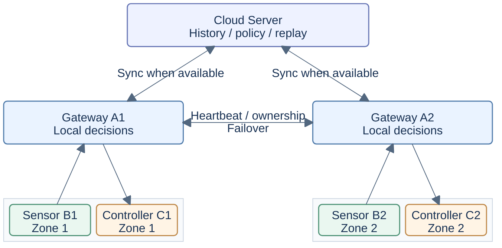

<h1 align="center">Smart Agriculture Edge AI</h1>

<p align="center"><strong>A Research Platform for Agricultural IoT and Edge AI</strong></p>

<p align="center">Trustworthy Sensing · Low-Power Communication · Safe Local Control · Reproducible Experiments</p>

---

<p align="center">An independently developed research prototype integrating embedded sensing, edge intelligence, and resilient IoT communication for smart agriculture.</p>

<p align="center">
  <a href="#project-overview">Overview</a> ·
  <a href="#system-architecture">Architecture</a> ·
  <a href="#implementation-status">Implementation</a> ·
  <a href="#related-research-projects">Related Projects</a> ·
  <a href="README.zh-CN.md">简体中文</a>
</p>

---

## Project Overview

Smart Agriculture Edge AI explores how agricultural IoT nodes can sense, assess data quality, and maintain local control under limited computing resources and intermittent connectivity. It combines embedded systems, edge AI, adaptive sampling, and resilient communication for battery-powered farm sensors, with ESP32-S3 and E220 LoRa as the target field platform.

The repository includes a working seven-role, two-zone software prototype, ESP32-S3 sensor firmware, and reproducible fault experiments. The host prototype uses real TCP sockets with simulated sensor inputs and actuator execution; the implementation status below separates these capabilities from physical measurements.

> **Cloud unavailable ≠ Farm unavailable**
>
> Sense and assess locally, make guarded decisions and execute control locally, communicate only when the information warrants it, and synchronize accumulated data when connectivity returns. The cloud supports history, policy updates, and future offline learning; it must never be required for the farm's real-time control loop.

## Key Features

- **Trustworthy Sensing — SensorTrust.** Per-channel validity and fault detection assess whether readings are usable. Action-specific trust gates prevent invalid data from authorizing control.

- **Adaptive Sampling — AdaptiveSense.** Sampling frequency follows environmental change and sensor health. Sampling and transmission are separate decisions, with event- and control-relevant uploads.

- **Local Edge Intelligence.** Gateways make irrigation and ventilation decisions locally through a shared DecisionEngine interface. Rule-based control is the default, with lightweight learned-model references available for research.

- **Reliable Communication & Offline Recovery.** Retries, stable message identities, deduplication, and durable queues support recovery from loss and outages. Receipt, execution outcome, and durable storage are tracked separately.

- **Dual-Gateway Failover.** A1/A2 exchange heartbeats and ownership information so the surviving gateway can serve both fixed zones. A recovered gateway remains on standby rather than automatically reclaiming control.

- **Safe Control & Cloud Synchronization.** Controllers check command authority, freshness, duplicates, and operating limits before execution. Gateways retain history locally and synchronize it independently of the local control path.

## System Architecture

### Compact System Overview

The diagrams show the complete seven-role architecture under normal ownership. Sensors and controllers are peers within each zone; the cloud is a synchronization and policy layer.



### Detailed Architecture

<details>
<summary>Expand the original full seven-role diagram</summary>

```text
                                      ┌─────────────────────────────┐
                                      │        Cloud Server         │
                                      │                             │
                                      │  • Sensor History           │
                                      │  • Node / Gateway Status    │
                                      │  • Control History          │
                                      │  • Alerts                   │
                                      │  • Policy Management        │
                                      │  • Deduplication            │
                                      │  • SQLite Persistence       │
                                      └──────────────┬──────────────┘
                                                     │
                                   telemetry / policy / replay
                                                     │
                        ┌────────────────────────────┴────────────────────────────┐
                        │                                                         │
                        ▼                                                         ▼
              ┌──────────────────────┐                                 ┌──────────────────────┐
              │      Gateway A1      │◄──── Heartbeat / Ownership ────►│      Gateway A2      │
              │                      │      Generation / Failover    │                      │
              │  • Node Registry     │                                 │  • Node Registry     │
              │  • Sensor Quality    │                                 │  • Sensor Quality    │
              │    Gate              │                                 │    Gate              │
              │  • Edge AI /         │                                 │  • Edge AI /         │
              │    DecisionEngine    │                                 │    DecisionEngine    │
              │  • ACK / Retry       │                                 │  • ACK / Retry       │
              │  • Dedup / Sequence  │                                 │  • Dedup / Sequence  │
              │  • Offline Queue     │                                 │  • Offline Queue     │
              │  • Local Autonomy    │                                 │  • Local Autonomy    │
              │  • Failover Control  │                                 │  • Failover Control  │
              └─────────┬────────────┘                                 └─────────┬────────────┘
                        │                                                         │
              ┌─────────┴──────────┐                                    ┌─────────┴──────────┐
              │                    │                                    │                    │
              ▼                    ▼                                    ▼                    ▼
     ┌─────────────────┐  ┌─────────────────┐                  ┌─────────────────┐  ┌─────────────────┐
     │    Sensor B1    │  │  Controller C1  │                  │    Sensor B2    │  │  Controller C2  │
     │                 │  │                 │                  │                 │  │                 │
     │ Physical / Sim  │  │ Command RX      │                  │ Physical / Sim  │  │ Command RX      │
     │ Sensors         │  │      ↓          │                  │ Sensors         │  │      ↓          │
     │      ↓          │  │ Receipt ACK     │                  │      ↓          │  │ Receipt ACK     │
     │ SensorTrust     │  │      ↓          │                  │ SensorTrust     │  │      ↓          │
     │      ↓          │  │ Safety Guard    │                  │      ↓          │  │ Safety Guard    │
     │ Health / Fault  │  │      ↓          │                  │ Health / Fault  │  │      ↓          │
     │      ↓          │  │ Owner / Epoch   │                  │      ↓          │  │ Owner / Epoch   │
     │ AdaptiveSense   │  │ TTL / Cooldown  │                  │ AdaptiveSense   │  │ TTL / Cooldown  │
     │      ↓          │  │ Idempotency     │                  │      ↓          │  │ Idempotency     │
     │ Sampling /      │  │      ↓          │                  │ Sampling /      │  │      ↓          │
     │ Upload Policy   │  │ Actuator        │                  │ Upload Policy   │  │ Actuator        │
     │      ↓          │  │ Execution       │                  │      ↓          │  │ Execution       │
     │ SENSOR_DATA /   │  │      ↓          │                  │ SENSOR_DATA /   │  │      ↓          │
     │ ALERT           │  │ CONTROL_RESULT  │                  │ ALERT           │  │ CONTROL_RESULT  │
     └────────┬────────┘  └────────▲────────┘                  └────────┬────────┘  └────────▲────────┘
              │                    │                                    │                    │
              └─────── Zone 1 ────┘                                    └─────── Zone 2 ────┘
```

</details>

Sensors B1/B2 assess readings and decide when to report. Gateways A1/A2 validate data, make local decisions, and manage delivery. Controllers C1/C2 guard execution and return outcomes; the Cloud Server stores history, alerts, and policies.

**Zone 1 always pairs B1 with C1; Zone 2 always pairs B2 with C2.** If A1 fails, A2 serves both zones; if A2 fails, A1 does the same. Gateway ownership can move, but sensor–controller pairing cannot. Heartbeat and ownership fencing support the tested recovery scenarios; they do not establish consensus under arbitrary network partitions.

## Implementation Status

**Implemented** means source is present; **Host-tested / Simulated** means workstation evaluation; **Hardware-tested** requires physical device evidence. Firmware builds do not establish a complete hardware system.

| Capability | Current status | Remaining work |
| --- | --- | --- |
| Seven-role, two-zone prototype | Implemented; host-tested over TCP and simulated LoRa | Complete field hardware integration |
| SensorTrust & AdaptiveSense | Implemented in host software and B1 firmware; host-tested | Field calibration and evaluation of sampling/upload behavior |
| Local decisions & dual-gateway failover | Implemented; host-tested with simulated control | Physical gateway coordination and hardware takeover demonstration |
| Reliable delivery & offline recovery | Implemented; host-tested durable sample/result delivery and cloud replay | Long outages, storage limits, and physical power-loss evaluation |
| ESP32-S3 B1 firmware | Implemented; build-verified sensing, delivery, light-sleep, and experimental deep-sleep profiles | Board validation of current profiles, state restoration, and power behavior |
| LoRa protocol & E220 UART | Implemented; host-tested framing/routing and build-verified B1 UART driver | Physical gateway/controller radio endpoints and end-to-end RF validation |
| Physical ESP32-S3 / SHT30 sensing | Hardware-tested in a limited temperature/humidity experiment | Additional sensor channels and complete wireless control loop |
| Edge AI model workflow | Implemented; host-tested synthetic policy-imitation models and export tools | Real agricultural datasets, field evaluation, and device inference |
| Real actuators & field deployment | Planned / pending hardware validation | Pumps, valves or fans, authenticated field links, energy and battery measurements |

The current `main` branch includes the integrated research implementation and is the default project branch; `research` is used for further research development. Deployment entry points remain disabled until the required link authentication is implemented.

## Quick Start

Use Python 3.10 or later. The host demo needs no hardware, and node runtimes use the Python standard library.

Clone the repository and prepare the environment:

```bash
git clone https://github.com/Sver0411/Smart-Agriculture-Edge-AI.git
cd Smart-Agriculture-Edge-AI
python3 -m venv .venv
source .venv/bin/activate
python -m pip install -r requirements.txt
```

Start all seven roles in one process:

```bash
python demo.py --duration 30
```

The roles communicate through local TCP sockets. The demo logs sensing, gateway decisions, simulated controller execution, and cloud history; it does not operate physical actuators.

Optional software checks (the complete suite also needs a C11 compiler):

```bash
python -m pytest tests/ -q
```

## Related Research Projects

These projects are maintained independently. Their device measurements and research results are separate from this repository's system evidence.

| Project | Research direction | Repository |
| --- | --- | --- |
| AdaptiveSense | Change-aware sampling and event detection; sensing/communication cost versus missed events | [AdaptiveSense](https://github.com/Sver0411/AdaptiveSense) |
| SensorTrust | Portable sensor-quality assessment and heuristic fault detection | [SensorTrust](https://github.com/Sver0411/SensorTrust) |
| EventGuard-LoRa | Critical-event delivery on E220 links under bounded redundancy and communication budgets | [EventGuard-LoRa](https://github.com/Sver0411/EventGuard-LoRa) |
| EdgeFaultLab | Deterministic IoT protocol/process fault injection, recovery assertions, and reproducible traces | [EdgeFaultLab](https://github.com/Sver0411/EdgeFaultLab) |
| TinyEdgeBench | Lightweight model comparisons, FP32/INT8 tradeoffs, and isolated ESP32-S3 resource measurements | [TinyEdgeBench](https://github.com/Sver0411/TinyEdgeBench) |
| AgriTinyVision | Lightweight crop-image anomaly triage, uncertainty rejection, training, quantization, and export | [AgriTinyVision](https://github.com/Sver0411/AgriTinyVision) |

**Integrated or reused:** SensorTrust detector semantics and C core, and AdaptiveSense's Python analyzer/scheduler are reused here. TinyEdgeBench informs the model/export workflow. EdgeFaultLab is used externally through an adapter, rather than vendored. Exact sources and reuse boundaries are recorded in the [reuse report](docs/V0_3_INTEGRATION_REPORT.md#2-reused-assets) and [source manifest](docs/integration_sources.json).

**Independent directions:** EventGuard-LoRa provides design/evaluation references; its redundancy policy is not integrated. AgriTinyVision's camera/model path is not connected to this system, and field/device inference validation remains pending.

## Documentation & Roadmap

Detailed design, experiment procedures, and historical evidence remain in `docs/` and `results/`.

<a id="run-reproducible-fault-experiments"></a>

| Topic | Documentation |
| --- | --- |
| Local autonomy and field design | [Deployment semantics](docs/DEPLOYMENT_SEMANTICS.md) · [Cloud boundaries](docs/CLOUD_BOUNDARIES.md) |
| Gateway architecture and reliability | [Sensor pipeline](docs/architecture/AR1_SENSOR_PIPELINE.md) · [Reliability report](docs/research/RELIABILITY_STABILIZATION_REPORT.md) |
| ESP32-S3 firmware and low-power profiles | [B1 firmware](firmware/b1/README.md) · [Experimental transport and sleep](firmware/b1/EXPERIMENTAL_TRANSPORT_SLEEP.md) |
| LoRa framing and E220 UART | [Protocol and UART implementation](docs/research/PHASE2_LORA_DEVELOPMENT_REPORT.md) |
| Experiments and retained evidence | [Cross-phase integration](docs/research/PHASE1_2_TO_PHASE3_INTEGRATION_REPORT.md) · [Historical hardware sensing](results/v0.3/README.md) · [Evidence archive](results/) |

Next research and engineering priorities:

- Commission complete E220 links for sensors, gateways, and controllers, with authenticated field sessions.
- Demonstrate dual-gateway hardware takeover while preserving the fixed zone pairs and operating without cloud access.
- Integrate real controllers and actuators, then evaluate safety under faults and restart.
- Validate deep-sleep restoration and measure current, energy use, and battery life.
- Collect real agricultural datasets and evaluate models before considering field deployment.

MIT licensed. Reused components retain their original license notices and source attribution.
