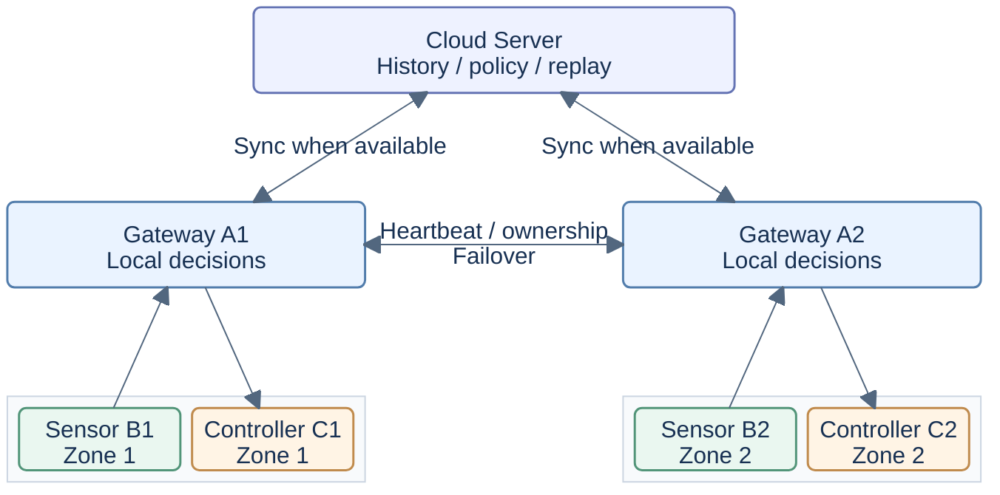

<h1 align="center">Smart Agriculture Edge AI</h1>

<p align="center"><strong>A Research Platform for Agricultural IoT and Edge AI</strong></p>

<p align="center">Trustworthy Sensing · Low-Power Communication · Safe Local Control · Reproducible Experiments</p>

---

<p align="center">An independently developed research prototype integrating embedded sensing, edge intelligence, and resilient IoT communication for smart agriculture.</p>

<p align="center">
  <a href="#project-overview">Overview</a> ·
  <a href="#system-architecture">Architecture</a> ·
  <a href="#implementation-status">Implementation</a> ·
  <a href="#related-research-projects">Related Projects</a> ·
  <a href="README.zh-CN.md">简体中文</a>
</p>

---

**Integration status:** The recorded PR #7 recovery blocker is [fixed and fully validated](docs/research/PR7_RECOVERY_FIX.md). [PR #7](https://github.com/Sver0411/Smart-Agriculture-Edge-AI/pull/7) and its [checks](https://github.com/Sver0411/Smart-Agriculture-Edge-AI/pull/7/checks) record publication into main. [Original failure evidence](docs/research/FINAL_BRANCH_INTEGRATION.md#publication-blocker-final-head-ci-failure) remains retained.

## Research at a Glance

| Topic | Research summary |
| --- | --- |
| Research Focus | Trustworthy sensing, selective communication, and safe local control under resource constraints and intermittent connectivity |
| System Prototype | Seven roles across two fixed agricultural zones: Server, gateways A1/A2, sensors B1/B2, and controllers C1/C2 |
| Core Techniques | SensorTrust, AdaptiveSense, control-relevant uploads, ownership/failover, guarded control, and durable offline replay |
| Software Validation | **631 tests per Python version**, TCP **20/20**, host simulated LoRa **20/20**, cross-phase **10/10**, external EdgeFaultLab **5/5**; [recorded results and integration checks](#experiments-and-results) |
| Integrated Research | Bounded LoRa/B1 UART, experimental RTC/NVS sleep restoration, durable sample/result delivery, restart-safe policies, and AR-1 sensor preparation; [source and scope](#main-and-research-branches) |
| Hardware Evidence | Historical ESP32-S3/SHT30 HW1: **30 CRC-valid readings**, zero physical read failures; sensing only. [Evidence guide](docs/RESEARCH_EVIDENCE_GUIDE.md#b-physical-esp32-s3--sht30-evidence) |
| Current Limitations | Integrated E220 wireless control, real actuators, deep sleep, energy/battery measurements, and agricultural effectiveness remain unverified |
| Related Research | [Explore six independently maintained research projects](#related-research-projects); their results are separate from this system's evidence |

## Quick Navigation

[Research Overview](#project-overview) · [System Architecture](#system-architecture) · [Key Research Components](#key-research-components) · [Implementation Status](#implementation-status) · [Experiments and Results](#experiments-and-results) · [Quick Start](#quick-start) · [Limitations](#limitations-and-future-work) · [Related Research Projects](#related-research-projects) · [Research Evidence Guide](#research-evidence-guide)

## Project Overview

The project studies how resource-constrained farm nodes can decide which readings deserve transmission and maintain a guarded local control loop when gateways or cloud connections fail. Agricultural IoT provides a concrete setting: slowly changing conditions, occasional important events, battery-powered sensors, and control decisions that depend on both data quality and freshness.

The complete seven-role prototype—Server, A1/A2 gateways, B1/B2 sensors, and C1/C2 controllers—runs on one computer using real TCP sockets with simulated sensor inputs and actuator execution. Node runtimes require only the Python standard library. ESP32-S3 B1 firmware and a limited physical sensing record are also included. System-level wireless control and energy evaluation remain future work.

## Research Motivation

- **Low-power sensing:** frequent sampling and radio activity compete with a battery budget. Sampling and transmission must be separate decisions, while important environmental changes still need to be observed.
- **Unreliable wireless communication:** loss, duplication, delay, and outages can separate a successful send from a received, executed, or durably stored message. Each stage needs its own identity and evidence.
- **Fresh control data:** an old but valid reading must not authorize a new action. Gateway ownership, generation, sequence, and command expiry constrain what may control a zone.
- **Local autonomy:** cloud availability must not determine whether a farm can carry out safe, bounded local actions. The gateway decides locally; the controller checks the command before execution.
- **Reproducible evaluation:** fault injection, fixed seeds, raw traces, and machine-checked assertions make failure behavior inspectable. They validate specified software scenarios; they do not establish field effectiveness or a new research contribution by themselves.

## Project North Star — Do Not Drift

**This section defines a lasting design constraint. Future README revisions must preserve its meaning and strength.**

The project is built for farms where devices run on batteries and connectivity is weak, intermittent, or entirely unavailable. Its central goal is:

> Let each node sense, assess, and act locally. Spend communication energy only when the information justifies it, then synchronize with the cloud when connectivity returns.

```text
Sense locally
    ↓
Evaluate locally
    ↓
Transmit only when necessary
    ↓
Decide locally
    ↓
Act locally
    ↓
Sync when connectivity allows
    ↓
Learn from accumulated field data

Cloud unavailable ≠ Farm unavailable
```

The cloud is an enhancement layer. It must never become a prerequisite for the farm's real-time control loop. Gateway A makes local decisions and Controller C executes them safely. The cloud stores history, handles synchronization, supplies policy improvements, and supports future offline training.

## System Architecture

### Compact System Overview

This is the **host-software topology**: TCP links with simulated sensor inputs and actuator execution. B1/C1 and B2/C2 remain fixed pairs. Gateways are shown under normal ownership; if either fails, the surviving gateway can serve both zones, as specified below. Bounded LoRa framing and the B1 E220 UART driver are implemented; complete physical A/C endpoints and RF validation remain pending.



### Two Agricultural Zones and Gateway Ownership

Zone 1 always pairs **B1 with C1**; Zone 2 always pairs **B2 with C2**. Each zone has a complete Sensor B, Gateway A, and Controller C. A1 and A2 exchange heartbeats, and synchronize with the cloud when a connection is available. The architecture below shows the normal deployment of both zones. Both are integral parts of the system.

| Operating state | Zone 1 | Zone 2 |
|---|---|---|
| Normal operation | B1 → A1 → C1 | B2 → A2 → C2 |
| A1 fails | B1 → A2 → C1 | B2 → A2 → C2 |
| A2 fails | B1 → A1 → C1 | B2 → A1 → C2 |

**Gateway ownership can move; zone membership cannot.** The B1→C1 and B2→C2 mappings in `CONTROLLER_OF_SENSOR` remain fixed. Takeover uses the existing OwnershipManager, heartbeat timeout, generation/epoch, registration, and stale-command rejection mechanisms. A recovered gateway enters STANDBY. There is no automatic failback.

### Detailed Architecture

<details>
<summary>Expand the original full seven-role diagram</summary>

```text
                                      ┌─────────────────────────────┐
                                      │        Cloud Server         │
                                      │                             │
                                      │  • Sensor History           │
                                      │  • Node / Gateway Status    │
                                      │  • Control History          │
                                      │  • Alerts                   │
                                      │  • Policy Management        │
                                      │  • Deduplication            │
                                      │  • SQLite Persistence       │
                                      └──────────────┬──────────────┘
                                                     │
                                   telemetry / policy / replay
                                                     │
                        ┌────────────────────────────┴────────────────────────────┐
                        │                                                         │
                        ▼                                                         ▼
              ┌──────────────────────┐                                 ┌──────────────────────┐
              │      Gateway A1      │◄──── Heartbeat / Ownership ────►│      Gateway A2      │
              │                      │      Generation / Failover    │                      │
              │  • Node Registry     │                                 │  • Node Registry     │
              │  • Sensor Quality    │                                 │  • Sensor Quality    │
              │    Gate              │                                 │    Gate              │
              │  • Edge AI /         │                                 │  • Edge AI /         │
              │    DecisionEngine    │                                 │    DecisionEngine    │
              │  • ACK / Retry       │                                 │  • ACK / Retry       │
              │  • Dedup / Sequence  │                                 │  • Dedup / Sequence  │
              │  • Offline Queue     │                                 │  • Offline Queue     │
              │  • Local Autonomy    │                                 │  • Local Autonomy    │
              │  • Failover Control  │                                 │  • Failover Control  │
              └─────────┬────────────┘                                 └─────────┬────────────┘
                        │                                                         │
              ┌─────────┴──────────┐                                    ┌─────────┴──────────┐
              │                    │                                    │                    │
              ▼                    ▼                                    ▼                    ▼
     ┌─────────────────┐  ┌─────────────────┐                  ┌─────────────────┐  ┌─────────────────┐
     │    Sensor B1    │  │  Controller C1  │                  │    Sensor B2    │  │  Controller C2  │
     │                 │  │                 │                  │                 │  │                 │
     │ Physical / Sim  │  │ Command RX      │                  │ Physical / Sim  │  │ Command RX      │
     │ Sensors         │  │      ↓          │                  │ Sensors         │  │      ↓          │
     │      ↓          │  │ Receipt ACK     │                  │      ↓          │  │ Receipt ACK     │
     │ SensorTrust     │  │      ↓          │                  │ SensorTrust     │  │      ↓          │
     │      ↓          │  │ Safety Guard    │                  │      ↓          │  │ Safety Guard    │
     │ Health / Fault  │  │      ↓          │                  │ Health / Fault  │  │      ↓          │
     │      ↓          │  │ Owner / Epoch   │                  │      ↓          │  │ Owner / Epoch   │
     │ AdaptiveSense   │  │ TTL / Cooldown  │                  │ AdaptiveSense   │  │ TTL / Cooldown  │
     │      ↓          │  │ Idempotency     │                  │      ↓          │  │ Idempotency     │
     │ Sampling /      │  │      ↓          │                  │ Sampling /      │  │      ↓          │
     │ Upload Policy   │  │ Actuator        │                  │ Upload Policy   │  │ Actuator        │
     │      ↓          │  │ Execution       │                  │      ↓          │  │ Execution       │
     │ SENSOR_DATA /   │  │      ↓          │                  │ SENSOR_DATA /   │  │      ↓          │
     │ ALERT           │  │ CONTROL_RESULT  │                  │ ALERT           │  │ CONTROL_RESULT  │
     └────────┬────────┘  └────────▲────────┘                  └────────┬────────┘  └────────▲────────┘
              │                    │                                    │                    │
              └─────── Zone 1 ────┘                                    └─────── Zone 2 ────┘
```

</details>

A1/A2 are edge gateways, B1/B2 are sensor nodes, and C1/C2 control the corresponding zones. Sensors and controllers sit alongside one another: B1 readings always govern C1, including after gateway takeover. The server, controllers, and gateway reliability mechanisms are all part of this repository.

## Key Research Components

The following components are implemented in this prepared research baseline; their verification boundaries are listed below.

| Component | Role in the research prototype | Source |
| --- | --- | --- |
| SensorTrust | Per-channel validity, health, and RANGE/STUCK/SPIKE/DRIFT/MISSING detection; action-specific trust gates | [sensor health](sensor_node/sensor_trust.py), [gateway gate](gateway/trust_gate.py) |
| AdaptiveSense | Change scores, STABLE/ACTIVE/ALERT states, hysteresis, sampling ladders, and selective uploads | [sampling policy](sensor_node/adaptive_sense.py) |
| Control-Relevant Upload | Report trustworthy threshold crossings and margin entry while keeping actuator decisions at the gateway | [relevance gate](sensor_node/control_relevance.py) |
| Gateway Ownership and Failover | Preserve fixed zones while transferring ownership with heartbeat and generation checks; recovered gateways stay STANDBY | [ownership](gateway/ownership.py) |
| Reliable Messaging and Deduplication | Stable command identities, bounded retries, separate receipt/result/persistence tracking, and transactional server deduplication | [reliability](common/reliability.py), [server](server/server.py) |
| Safe Edge Control | Serialized simulated execution, owner/epoch/TTL checks, cooldowns, and a bounded durable intent/result window | [safety guard](controller_node/safety_guard.py), [recent commands](controller_node/recent_commands.py) |
| Offline Queue and Recovery | File-backed SQLite outbox, reserved HIGH admission capacity, FIFO replay, and removal only after PERSISTED_ACK | [outbox](gateway/offline_queue.py) |
| Edge AI | Interchangeable Rule, Logistic, Tree, and MLP engines; reproducible synthetic policy-imitation references | [engines](ai/engines/), [training](ai/train.py) |
| Fault Injection and Reproducible Experiments | Seven-role host experiments, auditable metrics, and an adapter for the independent EdgeFaultLab runner | [experiments](experiments/runner.py), [external adapter](experiments/edgefaultlab.py) |
| Sensor Preparation (AR-1) | Pure record, trust, age/boot eligibility, and alert preparation; Gateway retains transactions, ACKs, live ownership, and dispatch | [pipeline](gateway/sensor_pipeline.py), [architecture](docs/architecture/AR1_SENSOR_PIPELINE.md) |
| Bounded Field Transport and Sleep | Host LoRa codec/reassembly, B1 E220 UART, opt-in RTC snapshots/NVS HIGH retention; hardware commissioning pending | [LoRa](common/lora/), [firmware profile](firmware/b1/EXPERIMENTAL_TRANSPORT_SLEEP.md) |
| Durable Results and Policy Publication | Stable controller-result replay, scoped durable receipts, and persistent server policy versions | [controller store](controller_node/recent_commands.py), [server database](server/database.py) |

## Implementation Status

**Implemented** means source is present in this branch. **Host-tested** means workstation tests or software fault experiments provide evidence. **Firmware compiled** means an ESP-IDF build succeeded, without implying a device run. **Hardware tested** requires recorded real-device observations. **Designed / Planned / Pending validation** identifies contracts or work still to be validated. These levels can overlap; they are not interchangeable.

| Capability | Current evidence | Remaining work or boundary |
|---|---|---|
| SensorTrust | Host-tested / Firmware compiled; historical HW1 normal readings | Field calibration of fault thresholds |
| AdaptiveSense | Host-tested / software fault experiments / Firmware compiled | Hardware verification of the revised semantics; real environmental events |
| B upload policy | Host-tested per sample in Python/C and through queue/sink / Firmware compiled | Radio uploads with the revised firmware |
| Physical SHT30 | Hardware tested: 30 historical reads with valid CRC | No board flashed during this work; channels beyond temperature/humidity untested |
| B low-power runtime | Host/C snapshot tested; four profiles compiled, including experimental Deep Sleep | Calibrated RTC elapsed, GPIO/radio sleep, NVS power cuts, current and battery measurements |
| B↔A LoRa | Bounded host protocol tested; B1 E220 UART source compiled | Physical Gateway endpoint, RF commissioning and end-to-end measurements |
| A DecisionEngine | Host-tested / software fault experiments | MCU port and agricultural effectiveness |
| A1/A2 heartbeat | Host-tested / software fault experiments | Local wireless hardware link |
| Gateway failover | Host-tested / software fault experiments | Complete hardware demonstration; no automatic failback |
| A↔C LoRa | Host topology, routing and control-fencing tests | Physical A/C E220 endpoints and RF tests |
| C actuator | Host-tested safety guard / simulated execution | Real relay, pump, and fan operation |
| Cloud offline replay | Host-tested durable sample/result receipts, FIFO replay, and policy-version recovery | Long-term capacity and power-loss evaluation |
| Dashboard | Designed | HTTP API and frontend |
| Training on real data | Designed; synthetic tools Host-tested | Field data, labels, GPU training, and registry |

The [HW1 record](results/v0.3/README.md) contains 30 CRC-valid SHT30 reads, with no physical read failures. Wi-Fi was unconfigured, no gateway upload was observed, and no environmental fault was injected. It verifies a sensing run, not an integrated B→A→C loop. It does not validate the revised upload policy, LoRa, power consumption, or failover. The [five-patch record](results/final-five-patches/README.md) separately records ESP-IDF v5.4.4 lab/deployment builds, including opt-in light sleep; those builds were not flashed for that evaluation.

### Main and Research Branches

This README describes the consolidated implementation prepared from `research` (`f5c2710`) and `main` (`08f573f`). Integration retains the main academic presentation, both languages, diagrams, and evidence navigation, while adopting the latest research source and complete CI matrix. [Final branch integration record](docs/research/FINAL_BRANCH_INTEGRATION.md) identifies the input revisions, branch audit, and validation status.

Phases 1/1.1 introduced bounded B1 HIGH retention and durable confirmation; Phases 1.2–3 added hardened registration/freshness, bounded LoRa framing and the B1 UART driver, and opt-in RTC/NVS sleep restoration. Stabilization added persistent control-result retries, restart-safe policy publication, sensor confirmation modes, and radio scheduling. AR-1 separates pure sensor preparation from Gateway coordination without changing runtime behavior. These additions form the research baseline; the recorded recovery blocker has a separately validated fix, and main publication requires complete final CI. Historical branch reports retain their original scope.

| Development line | Role after integration | Evidence boundary |
| --- | --- | --- |
| `main` | Release line; PR #7 records research publication and final checks | Historical 350-test acceptance and HW1 sensing remain separate from the new integration validation |
| `research` | Consolidated current functionality and main documentation, including the validated PR #7 recovery fix | Full Python 3.10/3.12, integration experiments and four ESP32-S3 CI builds pass; original failure retained |

Read the [cross-phase integration](docs/research/PHASE1_2_TO_PHASE3_INTEGRATION_REPORT.md), [reliability stabilization](docs/research/RELIABILITY_STABILIZATION_REPORT.md), and [AR-1 architecture/validation](docs/architecture/AR1_SENSOR_PIPELINE.md) reports. Seeded radio comparisons retain **43 COMPLETE / 13 INCOMPLETE** deliveries while all 56 safety checks pass. Optional peer HMAC supports isolated experiments; deployment entry points remain fail-closed until every required link authenticates. Source integration does not establish a hardware outcome.

## Experiments and Results

### Research Evidence Guide

The [English Research Evidence Guide](docs/RESEARCH_EVIDENCE_GUIDE.md) links the historical main acceptance, physical HW1 record, Phase 1–3 development, stabilization, and AR-1 evidence at explicit revisions. The [final integration record](docs/research/FINAL_BRANCH_INTEGRATION.md) separates fresh consolidation checks from those historical evaluations. Python versions repeat the same tests; their counts are not added.

### Latest Main Software Acceptance

The current integration checks are tracked in the [final integration record](docs/research/FINAL_BRANCH_INTEGRATION.md). The following table is the previously recorded AR-1 acceptance of the executable source being integrated; it is distinct from a new integration or hardware measurement.

The most recent complete AR-1 regression ran on executable-source commit `add9d076a04670b63b643fb822cfa84b23e99975`. Its final report commit `825bb92` passed complete [push CI](https://github.com/Sver0411/Smart-Agriculture-Edge-AI/actions/runs/37880089604) and [PR CI](https://github.com/Sver0411/Smart-Agriculture-Edge-AI/actions/runs/37880093415), with identical executable-source/configuration hashes. [AR-1 evidence](docs/architecture/AR1_SENSOR_PIPELINE.md) and the [stabilization report](docs/research/RELIABILITY_STABILIZATION_REPORT.md) explain scope, provenance, and retained failures.

| Evaluation | Recorded result | Scope |
| --- | --- | --- |
| Full pytest, Python 3.10 and 3.12 | 631 passed on each version | All 587 original tests plus 44 AR-1 cases; counts are not added across interpreters |
| Baseline/refactor behavior comparison | 256/256 matched | Actual processing methods; records, commands, order state, logs, metrics, and audit states |
| Original TCP fault scenarios | 20/20 PASS | Seven-role host topology and simulated actuation |
| Repeated ownership/reliability scenarios | 20/20 PASS | Stale generation ×10, failover ×3, recovery ×3, and four other fault cases |
| Host simulated-LoRa topology | 20/20 PASS | Actual application paths over a simulated RF carrier |
| Seeded LoRa comparison | 56/56 safety checks PASS | 43 COMPLETE and 13 INCOMPLETE deliveries; unconfirmed evidence is retained |
| Actual C sleep/restore reference | 19/19 PASS; 2800 observations | Known-elapsed oracle and conservative unknown-time cases; no physical RTC claim |
| Cross-phase integration / external EdgeFaultLab | 10/10 and 5/5 PASS | Production C/application paths and independently maintained fault runner |
| GitHub Actions | 6/6 jobs on both push and PR | Both Python suites, the full experiment matrix, and four firmware builds |
| ESP32-S3 firmware | Four profiles compiled under ESP-IDF v5.4.4 | lab, light-sleep, lora-prototype, deep-sleep-experimental; compilation is not a board experiment |

The earlier 350-test main acceptance remains preserved below as a historical baseline.

The [branch integration review](docs/BRANCH_INTEGRATION_REVIEW.md) records the historical 350-test `main` acceptance. The tested functional source is [`f204ad9`](https://github.com/Sver0411/Smart-Agriculture-Edge-AI/commit/f204ad9); the archived CI run tested [`002e26a`](https://github.com/Sver0411/Smart-Agriculture-Edge-AI/commit/002e26a), with the same functional source and additional documentation. Later evidence-only commits do not constitute a new experiment.

| Evaluation | Recorded result | Traceable evidence |
| --- | --- | --- |
| Full host test suite | 350 passed on each of Python 3.10, 3.12, and 3.14 locally | [acceptance commands and environment](results/main-integration-review/validation/acceptance.json), [local log](results/main-integration-review/validation/full-local.log) |
| Internal software fault scenarios | 20/20 PASS | [suite summary](results/main-integration-review/software-scenarios/suite_summary.json) |
| External EdgeFaultLab scenarios through this repository's adapter | 5/5 PASS | [suite summary](results/main-integration-review/edgefaultlab/suite_summary.json) |
| Main CI | Python 3.10/3.12: 350 tests each; Python 3.12: 20 internal + 5 external scenarios PASS | [CI run](https://github.com/Sver0411/Smart-Agriculture-Edge-AI/actions/runs/37734482845), [archived metadata](results/main-integration-review/validation/main-ci.json) |

The internal scenarios cover normal and full control loops; packet/ACK/result loss; duplicate, delayed, and reordered messages; sensor faults; gateway failover and recovery; stale generation; server outage and replay; policy replay; split brain; command expiry; registration races; lost durable acknowledgements; and unavailable controllers. External scenarios cover gateway failover, server outage, duplicated control, stale commands, and lost commands. These are host-software observations, with simulated actuation and controlled faults, not RF or real-actuator measurements. [Source manifest](results/main-integration-review/validation/source-manifest.json) records the tested source, hashes, seed, and external revision.

### Historical Baselines and Model References

The following results belong to the historical v0.3/v0.3.1 runs. Subsequent deployment-semantics work is documented in the [deployment realignment report](docs/DEPLOYMENT_REALIGNMENT_REPORT.md).

- The 155 tests from the v0.3 baseline were retained. v0.3.1 passed **231 tests**, with successful Python 3.10/3.12 [CI runs](https://github.com/Sver0411/Smart-Agriculture-Edge-AI/actions/runs/37177748586). Commands and evidence are in the [reliability report](docs/V0_3_1_RELIABILITY_REPORT.md).
- **20/20 internal scenarios passed**: the original 17, plus registration-race, persisted-ack-loss, and controller-unavailable.
- All five independent EdgeFaultLab scenarios passed after removing the adapter's startup delay. The initial v0.3 failures and subsequent regression records were preserved.
- Shared Python/C SensorTrust traces continued to pass on the host. No hardware was operated during that work.
- All three FP32 exports matched their trainers' predictions on 240 held-out samples. Four training/export files were reproduced byte for byte with the same seed.
- The INT8 weight-storage reference differed from FP32 on 2/240 Logistic predictions and 0/240 MLP predictions. Activations and biases remain floating point, and weights are dequantized before inference. There is no integer inference kernel or device-level result yet.

The new software capabilities have been **host-tested / software experimentally evaluated**. Historical B1 firmware and experiment records remain available in [firmware/b1](firmware/b1/README.md) and [results/v0.3](results/v0.3/README.md). Their verification scope is separate from these software results.

## Quick Start

Use Python 3.10 or later. CI verifies Python 3.10 and 3.12. Run host examples with simulation or lab profiles; current entry points deliberately refuse deployment.

```bash
python3 -m venv .venv
.venv/bin/pip install -r requirements.txt
.venv/bin/python demo.py --duration 30
.venv/bin/python -m pytest tests/ -q
```

Each role also has its own CLI. Run each node in a separate terminal with the environment activated:

```bash
source .venv/bin/activate
python -m server.server --port 9100 --db server.db
python -m gateway.gateway --id A1 --engine rule
python -m gateway.gateway --id A2 --engine rule
python -m sensor_node.sensor_node --id B1
python -m sensor_node.sensor_node --id B2
python -m controller_node.controller_node --id C1
python -m controller_node.controller_node --id C2
```

The demo retains normal, failover, and server-offline scenarios and stale/duplicate-command injection. Formal experiments use isolated configurations, ports, and databases. For sensor-side durable confirmation, use `--delivery-mode gateway-durable` on B and a file-backed `--queue-db` on the gateway; the compatibility default remains `legacy-write`.

### Run Reproducible Fault Experiments

```bash
python -m experiments.runner --all --output .research-runs/tcp-NEW
python -m experiments.reliability_stabilization --output .research-runs/repeats-NEW
python -m experiments.runner --all --transport simulated-lora --output .research-runs/lora-NEW
python -m experiments.lora_harness --seed 42 --output .research-runs/radio-NEW
python -m experiments.snapshot_harness --output .research-runs/snapshot-NEW
python -m experiments.phase123_integration --seed 42 --output .research-runs/integration-NEW

git clone https://github.com/Sver0411/EdgeFaultLab ../EdgeFaultLab
git -C ../EdgeFaultLab checkout c7248239f456cc877114ca1e67c5949fb4a7b958
python -m experiments.edgefaultlab --edgefaultlab-root ../EdgeFaultLab --output .research-runs/external-NEW
```

Run full Python versions sequentially on one machine because some existing e2e tests use fixed ports. Host C tests require a C11 compiler; applicable sanitizer checks are included in pytest. EdgeFaultLab remains external, pinned to the reviewed revision. A failed core assertion returns a nonzero exit code.

Experiments retain configuration, injection plans, raw events, metrics, summaries, and source/configuration hashes. Output directories refuse overwrite; CI preserves artifacts including failures. Metrics distinguish `null / not measured` from `0 / observed`, and distinguish reception, receipt ACK, execution outcome, and persistence. Existing research evidence is retained; new generated data goes to `.research-runs/` or CI artifacts.

## From a Reading to a Control Result

```text
SensorSource → SensorTrust → AdaptiveSense → SENSOR_DATA / ALERT
                                               ↓
Gateway: quality gate → DecisionEngine → CONTROL_COMMAND
                                               ↓
Controller: ACK → SafetyGuard → simulated execution → CONTROL_RESULT
                                               ↓
Gateway: live upload / SQLite OfflineQueue → Server: atomic dedup + history
```

- **SensorTrust** tracks RANGE, STUCK, SPIKE, DRIFT, and MISSING faults independently for each channel. It reports `health_score`, `fault_flags`, and a HEALTHY/DEGRADED/FAULT classification. DRIFT is measured as a rate of change per second. Reading validity is separate from the fault score: an invalid reading cannot authorize control, even before MISSING has been confirmed.
- **Trust requirements follow the action.** Rule-based irrigation needs trustworthy soil moisture; ventilation needs trustworthy temperature. A fault in an unrelated channel does not block an independent action. Logistic, Tree, and MLP require all four channels to be valid and HEALTHY. Overall health and fault history are still recorded. ALERT messages are sent when health or the fault signature changes, with reminders every 300 seconds and a notification on recovery.
- **AdaptiveSense** uses normalized EMA/STD/ROC scores and a STABLE/ACTIVE/ALERT state machine. Escalation is immediate; relaxation proceeds in stages with hysteresis and interval ladders. Upload triggers include the first valid sample, state or interval changes, event onset or recovery, meaningful changes in valid data, and a low-frequency upload heartbeat. Faulty readings are excluded from environmental change scoring, and the environmental baseline is rebuilt on recovery.
- **Sampling and connection maintenance serve different purposes.** Python SensorNode is the Host Simulation Profile. Socket reception, second-scale NODE_STATUS messages, and sampling run independently so that protocol behavior, CI, takeover, and fault injection can be tested. A battery-powered field node is intended to communicate intermittently and avoid online heartbeats every few seconds. **Simulation timing ≠ Deployment timing.**
- **DecisionEngine** gives Rule, Logistic, Tree, and MLP the same `predict(sample, policy)` interface. Rule is the default. The other models are reproducible references trained to imitate a synthetic policy with a fixed seed, supporting training, export, and engine-switching tests. They have not been validated as agricultural control models using real field data. Feature order and version are fixed in `ai/features.py`.

## Reliability and Safety

- B/C registration and connection routing establish which socket may speak for a node, its owner, and its generation. Inconsistent sources and stale generations are rejected.
- Liveness, retries, cooldowns, and sample age use monotonic time. Protocol timestamps and historical records retain wall-clock time; client timestamps do not determine liveness. Reliable and physical samples include gateway queue wait in the five-second control-age limit and must match the registered boot. Age is checked again after durable admission and ACK waiting, immediately before a decision.
- Reliable sensor samples retain their original boot/sequence identity across loss, buffering, and restart. Gateway commits a receipt and history to a file-backed SQLite outbox before sending the scoped `GATEWAY_OUTBOX` PERSISTED_ACK. Duplicate retries are acknowledged without creating another receipt or control decision. Old-boot, expired, or unknown-age reliable evidence remains historical.
- Host SensorNode offers `legacy-write` compatibility and opt-in `gateway-durable` confirmation. In durable mode, HIGH pending evidence is checkpointed; NORMAL remains RAM-only. The confirmed upload baseline advances only on a matching durable ACK. An ACK for old-boot history retires that evidence without confirming a new-boot baseline.
- CONTROL_COMMAND keeps a stable `message_id`/`command_id`, a finite ACK retry budget, and controller-side idempotency. Its ACK confirms receipt, while CONTROL_RESULT reports execution. A missing result becomes UNKNOWN; a late result can resolve uncertainty. The system never issues a new action to repair a missing result.
- Controllers process commands serially. SafetyGuard checks type, identity, TTL, owner/generation, duplicates, duration, and cooldown. Intent and outcome checkpoints support conservative restart behavior. CONTROL_RESULT has a bounded persistent resend window and stable wire content; a scoped `CONTROL_RESULTS` durable ACK retires pending delivery. Gateway commits result receipt, history, and outcome before acknowledging it.
- Heartbeat timeout transfers ownership and advances generation. A recovered gateway remains STANDBY, with no automatic failback. The failure detector accounts for local monitor suspension before concluding that a peer failed; this does not establish consensus under arbitrary partitions.
- Cloud uploads use a bounded SQLite outbox with reserved HIGH capacity, stable identities, FIFO replay, and commit-before-ACK server deduplication. Cloud reconnection and replay use separate tasks. Invalid uploads do not consume identities, and lost acknowledgements leave evidence available for a deduplicated retry.
- An expired, unavailable, or unauthorized unsent command is recorded as NOT_DISPATCHED. Delivery that may already have occurred can remain UNKNOWN. Actuator commands are not queued for later execution after an outage.
- SERVER_POLICY validates content and version before persistent activation. Gateway recovers the last valid policy; server publication persists its content and version together, so restart cannot reset the publication counter. Unchanged content and repeated broadcast do not allocate new versions. Policy ACK remains a receipt acknowledgement, not a guaranteed retry contract.
- Peer HMAC sessions are available for isolated A1/A2 experiments. B↔A, A↔C, cloud, and physical RF links still lack the complete authenticated-session design. `profile=deployment` is therefore refused before startup, even with a valid peer key. CRC is an integrity check, not authentication.

### Protocol Compatibility

TCP messages are newline-delimited JSON. The original six-field envelope remains supported:

```json
{"type":"SENSOR_DATA","source":"B1","target":"A1","timestamp":1234567890.0,"message_id":"sample-001","payload":{}}
```

Optional fields are `protocol_version:1`, `sequence`, `attempt`, and `generation`. Messages without them follow the legacy protocol. New simulated sensors identify logical samples with a boot ID and sequence number. Reordered or duplicated old readings can remain in the audit history, but cannot trigger new control.

Parsing rejects non-finite or overflowing numbers, incorrect field types, unsupported versions, and oversized frames. Gateway and server upgrades must be coordinated: a new gateway retains its outbox copies if an old server cannot provide durable acknowledgements. The JSON envelope and LoRa CRC do not authenticate B/C/cloud identities. Optional peer HMAC sessions cover A1/A2 experiments only; deployment remains disabled until all required links authenticate.

## Configuration and Timing Profiles

`config/software.json` defines the software baseline and complete topology. `common/settings.py` validates it, while `common/config.py` retains compatibility constants. Set `SMART_AGRICULTURE_CONFIG=/path/config.json` to select a baseline for independent processes. Constructor overrides and experimental `runtime_overrides` are recorded in the experiment configuration.

Profiles in `config/profiles/` configure sampling and uploads separately from cloud reconnection:

| Profile | STABLE | ACTIVE | ALERT | Upload heartbeat in stable conditions |
|---|---|---|---|---|
| simulation | 20→40→60 s | 15→10→5 s | 5 s | 60 s |
| lab | 2→4→5 s | 2→1 s | 1 s | 300 s |
| deployment | 20→40 min | 10→5 min | 5→2→1 min | 6 h |

Deployment values are **engineering defaults**, not authorization to enable deployment. They need calibration against crop characteristics, sensor noise, environmental dynamics, battery measurements, and field trials. Thresholds, EMA windows, event duration, and fault reminders are configurable as well. A deployment profile changes the behavior of the system beyond a single sleep interval.

`config/physical_b1.json` explicitly preserves the historical temperature/humidity SensorTrust settings. Run `python scripts/generate_b1_profiles.py` to generate B1's C parameters, or use `--check` to detect stale generated configuration.

Python/C Upload Decision Parity tests feed identical inputs to both implementations and compare state, next interval, detected event, and upload request for every sample. Coverage includes stable conditions, gradual change, sudden change, event onset and recovery, sensor faults, periodic uploads, and large deltas. These shared traces provide test evidence, not a mathematical proof across every floating-point boundary.

## Offline Model Tools

Only offline training requires the additional dependencies. Running the nodes does not require sklearn or numpy.

```bash
pip install -r requirements-training.txt
python -m ai.train --seed 42 --output ai/artifacts
python -m ai.quantize --output ai/artifacts/int8
python -m ai.benchmark --output model_benchmark.json
```

`ai.train.train(..., rows=feature_label_rows)` accepts externally supplied feature/label rows and labels the output `user-provided-unvalidated`. This provides an entry point for future datasets. Model exports record the training/holdout split, data hash, seed, feature version, and source.

Logistic made 10/240 policy-imitation errors on the synthetic holdout set. That negative result is retained; it does not measure agricultural effectiveness. Host latency and JSON size must not be presented as MCU latency, flash consumption, or energy measurements.

## Sensor B's Physical Deployment Profile

> Sense locally and communicate only when information is worth the energy.

```text
Wake → Read Sensors → SensorTrust → AdaptiveSense → Update local state
    → Decide next sampling interval → Decide whether transmission is necessary
        ├── NO  → Sleep
        └── YES → Wake radio → LoRa → A → Radio sleep → Sleep
```

**Sampled != transmitted.** B1's `upload_requested` now reaches the sample, transmission queue, and transmission guard. A stable reading no longer enters the queue automatically. Communication events include the first valid sample, important state changes, confirmed event onset or recovery, large deltas, health/fault changes, low-frequency health reports, and configured critical conditions. An unchanged fault signature does not cause every faulty sample to be transmitted.

**Low-Power Communication:** a control-relevant threshold crossing requests an immediate upload. The lightweight ControlRelevanceGate compares trustworthy channels with their last successfully reported or admitted values. It detects both directions of crossing for soil `< threshold` and temperature `> threshold`. A configurable profile margin can also request a report when a value enters the threshold's neighborhood. `upload_reasons` retains every trigger. Untrusted channels follow the sensor-fault path; an unrelated fault does not hide a trustworthy temperature crossing. Gateway A remains responsible for the control decision.

The ESP32 Wi-Fi/TCP implementation in `firmware/b1` is a **Development / Integration Transport**. It retains its value for hardware integration while keeping sensing logic independent of sockets. `b1_telemetry.c` builds business payloads, `b1_transport.h` provides the sink interface, and `b1_network.c` implements the TCP/Wi-Fi adapter.

Physical B1 sensing currently covers SHT30 temperature and humidity. Soil-moisture control relevance is tested in the host prototype, not with a physical B1 soil sensor.

Python `SensorRuntime` and `MockFieldTransport` test the radio wake/send/sleep flow on the host. The Python TCP SensorNode accepts only simulation and lab profiles. Combining deployment's minute-scale sampling with second-scale online keepalive does not establish a battery-powered deployment.

The lab and light-sleep profiles retain Wi-Fi/TCP integration. The B1 E220 driver uses a bounded UART/AUX communication window and an empty-to-nonempty/HIGH notification scheduler with unavailable-link backoff. Local UART completion is not a receiver receipt; only the matching scoped gateway ACK can retire reliable evidence. Physical radio wake/sleep, AUX timing, and RF behavior still require measurement.

Phase 3 now provides an opt-in Deep Sleep task, RTC algorithm snapshots, and NVS HIGH restoration. SensorTrust/AdaptiveSense state continuity is tested with the actual C implementation. The default elapsed-time provider returns UNKNOWN, so the firmware conservatively rebuilds temporal/report baselines rather than treating planned sleep time as measured time. Each wake obtains a new boot identity; historical HIGH keeps its original identity. See the [sleep profile and commissioning requirements](firmware/b1/EXPERIMENTAL_TRANSPORT_SLEEP.md). Board-level continuity, current, and battery life remain unmeasured.

The target field platform is **ESP32-S3 + E220 LoRa**, covering B↔A and A↔C. A1↔A2 coordination must also work independently of the internet, the cloud, and a Wi-Fi access point. Bounded framing/reassembly, role routing, retries, and the B1 UART driver are implemented and host-tested or compiled. Gateway/controller physical E220 endpoints and complete wireless registration, ownership notification, and heartbeat integration remain pending hardware work.

**Field LoRa Semantics:** B belongs to a zone, not permanently to a gateway. Uplinks carry `source_node_id`, `zone_id`, sequence, boot/session identity, and the payload. Only the current zone owner may control its fixed C node. Gateway logic detects failover; B is not expected to listen continuously to both gateways or send frequent probes.

TCP fallback supports host integration. The eventual LoRa uplink can address the zone, so B can keep its zone identity without first changing a destination gateway. Necessary local policy and epoch exchanges occur during communication windows. Their final timing still requires hardware verification.

## Gateway A's Local Autonomy and Weak-Link Synchronization

The local path remains receive B → validate / Trust Gate → DecisionEngine → CONTROL_COMMAND → C → CONTROL_RESULT. [sensor_pipeline](gateway/sensor_pipeline.py) prepares records, trust, freshness, and alert evidence through pure functions. Gateway retains sequence/boot state, SQLite admission, ACKs, live ownership, generation, and command dispatch; the existing processing interfaces remain available. Cloud reconnection and outbox replay run in separate tasks. Slow cloud receipts do not block local persistence of new history or the B→A→C loop.

Cloud connectivity has ONLINE, DEGRADED, and OFFLINE states. Deployment reconnection backs off through 5/15/30/60/300 seconds; simulation and lab have their own settings. After reconnection, replay is throttled according to configuration, and each row still requires its own PERSISTED_ACK before deletion. An explicit CRITICAL event can request one early reconnect, subject to cooldown.

Gateway heartbeats carry connectivity state and outbox depth, byte usage, oldest-record age, and rejection counts into cloud history. The host TCP heartbeat implementation does not establish that the field system will keep operating after its Wi-Fi access point is disconnected.

**Offline Queue:** capacity is reserved for critical records. Of the default 10,000 messages / 16 MiB, 1,000 messages / 1,677,722 bytes are reserved for HIGH traffic. NORMAL admission stops at that reserve boundary; HIGH can use the remaining total capacity. CONTROL_RESULT, CRITICAL events, command-delivery failures, gateway takeover, and severe sensor faults receive HIGH priority.

When total capacity is exhausted, new admission is explicitly rejected and recorded in priority metrics, logs, and local alert state. Previously admitted messages are retained. FIFO order, stable identities, deduplication, and PERSISTED_ACK semantics remain intact.

**Controller Safety:** recent command IDs must survive restart before real actuators are deployed. The host RecentCommandStore keeps a configurable bounded window, defaulting to 64. It persists INTENT before simulated execution, then persists the result. Corruption or failure to write the intent defaults to DO NOT EXECUTE. An incomplete intent also blocks replay after restart, but does not prove successful execution. A future ESP32 controller will need an NVS backend; this has not been verified on a board.

**Time Semantics:** wall-clock time alone is insufficient to establish the freshness of an offline control command. The host LoRa freshness contract combines owner/epoch, gateway and receiver boot sessions, command sequence/identity, a receive window issued in advance by the receiver, and monotonic expiry/retry bounds. Its physical A/C endpoint integration is pending. The host contract can validate fresh commands without wall-clock time; TCP retains its compatible timestamp TTL. Starting a new TTL when an old packet arrives does not make it fresh. See the [five patches and their evidence](results/final-five-patches/README.md).

## Cloud Responsibilities and Learning from Field Data

The cloud provides TCP reception, SQLite history, atomic deduplication with PERSISTED_ACK, and restart-safe policy publication. Policy content and version are persisted together; unchanged content and rebroadcast preserve the version. **An HTTP API and Web Dashboard are still missing.**

The next read-only API should expose zone status, latest readings and history curves, gateway ownership and connectivity, alerts, control history, and outbox/replay status. It must distinguish stale data from a low-power node that is expected to be asleep. The design is documented in [cloud boundaries](docs/CLOUD_BOUNDARIES.md). This work introduces no broker, microservices, or Kubernetes.

Logistic, Tree, and MLP remain synthetic policy-imitation models: **they are not validated agricultural intelligence**. The intended future workflow is:

```text
Field Data → Cloud DB → Dataset Builder → Versioned Dataset
    → RTX GPU Offline Training → Candidate Model → Evaluation
    → Model Registry → Approved Deployment
```

Retraining will be batched or scheduled. Receiving one sample must never trigger a new training run. External rows are currently accepted by the software training interface, but field labels, versioned datasets, RTX GPU training, evaluation approval, a model registry, and automated deployment remain unimplemented.

## Roadmap — Gateway Failure Hardware Demonstration

One of the next stage's most important system-level hardware experiments is:

```text
Normal: B1 → A1 → C1   and   B2 → A2 → C2
Power off A1
    ↓
A2 detects local heartbeat timeout
    ↓
A2 persists a newer epoch and takes ownership of Zone 1
    ↓
B1 → A2 → C1   while   B2 → A2 → C2 continues
Restore A1
    ↓
A1 sees newer generation → remains STANDBY
```

Run the demonstration with the internet and cloud disconnected, and verify that coordination also works independently of the Wi-Fi access point. Record the zone, owner/generation, ACK, and execution outcome for every sample and command. Inject an old A1 command and confirm that C1 rejects it.

This demonstration requires commissioned A/B/C RF links, restart-safe board state for the gateway/controller, calibrated B sleep timing, and real actuator integration. It remains **Pending hardware validation**. Camera input, Tiny Vision, YOLO, and image uploads are outside the scope of this work.

## Limitations and Future Work

- Receipt ledgers, HIGH buffers, result resend windows, and recent-command protection are bounded. Capacity pressure rejects admission explicitly; identities are not silently pruned. Physical disk/WAL growth, Flash wear, prolonged outages, and proven receipt retirement still need operational evaluation.
- Host ownership/generation and command intent/outcome checkpoints support fail-closed restart behavior. The ESP32 controller and gateway physical RF endpoints are absent. Unobservable crash windows and bounded dedup history prevent an unconditional exactly-once actuator guarantee.
- Dual-gateway heartbeat failure detection is not distributed consensus. Existing split-brain, one-way-loss, recovery, and stale-generation experiments cover stated fault schedules, not exclusive control under arbitrary partitions.
- Legacy-write telemetry remains best effort. Nonphysical legacy lab inputs use ingress age and per-boot ordering without the reliable/physical registered-boot gate. Reliable HIGH history survives checkpoint/retry, but NORMAL host pending data is RAM-only. ACK-send failure after commit does not replay an interrupted control decision on retry. [AR-1 boundaries](docs/architecture/AR1_SENSOR_PIPELINE.md#remaining-architecture-debt) document these preserved behaviors.
- Optional HMAC protects peer experiments only. B/C/cloud/RF session authentication, encryption, cross-node clock commissioning, and field calibration remain incomplete; deployment mode stays refused.
- E220 RF reliability, A/C integration, GPIO/AUX/reset behavior, calibrated RTC elapsed time, NVS power cuts, real actuator operation, current, and battery life remain pending hardware validation. Experimental source and four successful firmware builds do not settle these questions.
- STUCK and DRIFT are heuristic indicators that can also describe real environmental behavior. Learned models remain synthetic policy references; full C inference parity, agricultural effectiveness, MCU resources, and energy have not been established.

## Related Research Projects

These are related but independently maintained projects. Their experiments describe their own workloads and devices, not a completed agricultural system in this repository.

| Project | Research Focus | Repository |
| --- | --- | --- |
| AdaptiveSense | Change-aware sampling and event detection on constrained nodes; Python/C policy parity and the tradeoff between sampling/communication cost and missed events | [AdaptiveSense](https://github.com/Sver0411/AdaptiveSense) |
| SensorTrust | Portable sensor-quality and fault detection for RANGE, STUCK, SPIKE, DRIFT, and MISSING; heuristic health scores and auditable single-channel experiments | [SensorTrust](https://github.com/Sver0411/SensorTrust) |
| EventGuard-LoRa | Critical-event delivery versus bounded packet-copy and byte cost on an E220 link, with matched-budget baselines and preserved negative findings | [EventGuard-LoRa](https://github.com/Sver0411/EventGuard-LoRa) |
| EdgeFaultLab | Deterministic protocol-level fault injection, process failure/restart, recovery assertions, and reproducible traces for distributed IoT systems | [EdgeFaultLab](https://github.com/Sver0411/EdgeFaultLab) |
| TinyEdgeBench | Rule, Logistic, Tree, and MLP comparisons on a shared synthetic sensor-window task; isolated ESP32-S3 latency/Flash measurements and FP32/INT8 tradeoffs | [TinyEdgeBench](https://github.com/Sver0411/TinyEdgeBench) |
| AgriTinyVision | Lightweight crop-image anomaly triage: NORMAL/SUSPECT classification, UNKNOWN rejection, GPU training, quantization, and export; field and device inference validation remain pending | [AgriTinyVision](https://github.com/Sver0411/AgriTinyVision) |

**Integrated or reused:** SensorTrust detector semantics and its C core, and AdaptiveSense's Python analyzer/scheduler are reused in `main`. TinyEdgeBench informs the independently trained model/export workflow. EdgeFaultLab runs externally through the local adapter; its engine is not vendored. Reviewed revisions and exact reuse boundaries are recorded in [integration sources](docs/integration_sources.json) and the [integration report](docs/V0_3_INTEGRATION_REPORT.md).

**Independent research or planned integration:** EventGuard-LoRa supplies design/evaluation references, not an integrated radio driver or copied redundancy policy. AgriTinyVision is a companion model pipeline; its camera/model path is not connected to `main`'s DecisionEngine. Its host quantization and firmware-example build do not establish ESP32 inference in this system. Hardware measurements from EventGuard-LoRa, TinyEdgeBench, SensorTrust, or AdaptiveSense cannot be presented as this repository's hardware results.

## Documentation and Next Steps

[v0.3.1 reliability report](docs/V0_3_1_RELIABILITY_REPORT.md) · [code review](docs/V0_3_1_RELIABILITY_REVIEW.md) · [v0.3 integration and reuse report](docs/V0_3_INTEGRATION_REPORT.md)

Latest records: [final branch integration](docs/research/FINAL_BRANCH_INTEGRATION.md), [Phase 1.2](docs/research/PHASE1_2_DEVELOPMENT_REPORT.md), [LoRa protocol/UART](docs/research/PHASE2_LORA_DEVELOPMENT_REPORT.md), [experimental sleep](docs/research/PHASE3_DEEPSLEEP_DEVELOPMENT_REPORT.md), [cross-phase integration](docs/research/PHASE1_2_TO_PHASE3_INTEGRATION_REPORT.md), [reliability stabilization](docs/research/RELIABILITY_STABILIZATION_REPORT.md), and [AR-1 architecture](docs/architecture/AR1_SENSOR_PIPELINE.md). The [earlier branch integration review](docs/BRANCH_INTEGRATION_REVIEW.md) and all raw evidence retain their historical scope. AR-2/AR-3/AR-4 are not implemented here.

Next priorities are physical A/C E220 endpoints and authenticated sessions, RTC/NVS calibration, and real actuation/power measurement before the hardware takeover demonstration. The complete two-zone topology remains a permanent part of the project.

MIT licensed. Directly reused AdaptiveSense Python files retain their MIT license notices and source attribution.
