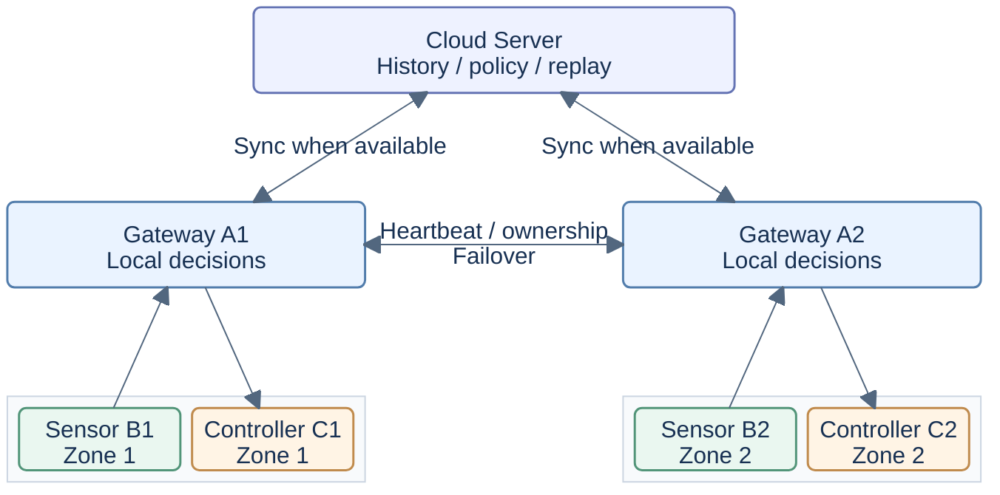

# Smart-Agriculture-Edge-AI

[English](README.md) | [简体中文](README.zh-CN.md)

面向农业物联网的分布式边缘智能研究原型，探索可信感知、按需通信、安全本地控制，以及不稳定连接下的故障恢复。

## 研究概览

| 主题 | 研究摘要 |
| --- | --- |
| 研究问题 | 资源受限、连接不稳定时的可信感知、选择性通信与安全本地控制 |
| 系统原型 | 两个固定农业区域、七个角色：Server、A1/A2 网关、B1/B2 传感器、C1/C2 控制器 |
| 核心方法 | SensorTrust、AdaptiveSense、控制相关上传、归属与接管、安全控制、持久化离线回放 |
| 软件验证 | `main`：**350 项测试、20/20 内部故障场景、5/5 外部 EdgeFaultLab 场景**；2026-10-08 验收源码 `f204ad9`，CI 版本 `002e26a`。多个 Python 版本重复验证同一测试集，不累加数量。[结果与来源](#实验与结果) |
| 实物证据 | 历史 ESP32-S3/SHT30 HW1：**30 次 CRC 有效读取**，无物理读取失败；仅验证感知。[英文证据摘要](docs/RESEARCH_EVIDENCE_GUIDE.md#b-physical-esp32-s3--sht30-evidence) |
| 当前限制 | E220 无线控制闭环、真实执行器、deep sleep、能耗/电池测量与农业效果仍未验证 |
| 相关研究 | [查看六个独立维护的研究项目](#相关研究项目)；其结果与主系统证据分开 |

## 快速导航

[项目概览](#项目概览) · [系统架构](#系统架构) · [核心研究模块](#核心研究模块) · [实现与验证状态](#实现与验证状态) · [实验与结果](#实验与结果) · [快速开始](#快速开始) · [限制与后续工作](#限制与后续工作) · [相关研究项目](#相关研究项目) · [英文研究证据导览](#英文研究证据导览)

## 项目概览

本项目研究一个具体问题：资源受限的农业节点如何判断哪些读数值得传输，并在网关故障或云端断连时维持受安全约束的本地控制。农业物联网提供了明确的应用背景：环境通常缓慢变化，重要事件偶尔出现，传感器依赖电池供电，而控制决策同时依赖数据质量与新鲜度。

完整原型包含七个角色：Server、A1/A2 网关、B1/B2 传感器节点和 C1/C2 控制节点。它们可以在一台电脑上通过真实 TCP socket 通信，传感器输入与执行器动作使用模拟实现。节点运行时仅依赖 Python 标准库。仓库还包含 ESP32-S3 B1 固件和范围有限的实物感知记录；系统级无线控制与能耗评估仍待完成。

## 研究动机

- **低功耗感知**：频繁采样和无线通信都会占用电池预算。采样与上传应分别决策，同时需要观察重要环境变化。
- **无线通信可靠性**：丢失、重复、延迟和断网使“成功发送”与“收到、执行、持久化”成为不同状态，每个阶段都需要独立的消息身份和证据。
- **控制数据的新鲜度**：旧读数即使数值有效，也不能授权新动作。网关归属、generation、sequence 和命令过期检查共同约束区域控制。
- **本地自主能力**：云端是否在线不应决定现场能否执行安全、有限的本地动作。网关本地决策，控制器在执行前检查命令。
- **可复现评估**：故障注入、固定随机种子、原始事件和机器断言，使失败行为可以检查和复现。这些证据验证指定的软件场景，本身不代表农业效果或已成立的科研创新。

## Project North Star — Do Not Drift

**这是长期设计约束；以后 README 重构不得删除或弱化本章节。**

项目的目标不是“把所有农业传感器数据实时发送到服务器”。真正目标是：

> 在电池供电、弱网甚至完全没有互联网连接的农业环境中，让各节点在本地完成感知、判断和控制，只在信息值得通信成本时才传输，并在网络恢复后再与云端同步。

```text
Sense locally
    ↓
Evaluate locally
    ↓
Transmit only when necessary
    ↓
Decide locally
    ↓
Act locally
    ↓
Sync when connectivity allows
    ↓
Learn from accumulated field data

Cloud unavailable ≠ Farm unavailable
```

Cloud Server 是增强层，绝不能成为现场实时控制闭环的必要组成部分。A 在本地作判断，C 安全执行；Cloud 用于历史、同步、策略增强和未来离线训练。

## 系统架构

### 精简系统概览

下图是**主机软件拓扑**：TCP 通信，模拟传感器输入与执行器动作。B1/C1、B2/C2 是固定区域配对；网关位置表示正常归属。任一网关故障后，另一网关可以服务两个区域，具体路径见下表。计划中的现场 E220 传输尚未在这里实现或完成硬件验证。



### 两个农业区域与网关归属

Zone 1 固定对应 **B1 与 C1**，Zone 2 固定对应 **B2 与 C2**。每个区域都有完整的 Sensor B、Gateway A 和 Controller C。A1/A2 交换心跳，并在连接可用时与云端同步。下图展示两个区域的正常部署关系，两者都是系统的完整组成部分。

| 运行状态 | Zone 1 | Zone 2 |
| --- | --- | --- |
| 正常运行 | B1 → A1 → C1 | B2 → A2 → C2 |
| A1 故障 | B1 → A2 → C1 | B2 → A2 → C2 |
| A2 故障 | B1 → A1 → C1 | B2 → A1 → C2 |

**网关归属可以迁移，区域成员关系不能改变。** `CONTROLLER_OF_SENSOR` 中的 B1→C1、B2→C2 始终固定。接管依赖 OwnershipManager、心跳超时、generation/epoch、注册和旧命令拒绝机制。恢复的网关进入 STANDBY，不自动切回。

### 详细架构

<details>
<summary>展开原有七角色完整架构图</summary>

```text
                                      ┌─────────────────────────────┐
                                      │        Cloud Server         │
                                      │                             │
                                      │  • Sensor History           │
                                      │  • Node / Gateway Status    │
                                      │  • Control History          │
                                      │  • Alerts                   │
                                      │  • Policy Management        │
                                      │  • Deduplication            │
                                      │  • SQLite Persistence       │
                                      └──────────────┬──────────────┘
                                                     │
                                   telemetry / policy / replay
                                                     │
                        ┌────────────────────────────┴────────────────────────────┐
                        │                                                         │
                        ▼                                                         ▼
              ┌──────────────────────┐                                 ┌──────────────────────┐
              │      Gateway A1      │◄──── Heartbeat / Ownership ────►│      Gateway A2      │
              │                      │      Generation / Failover    │                      │
              │  • Node Registry     │                                 │  • Node Registry     │
              │  • Sensor Quality    │                                 │  • Sensor Quality    │
              │    Gate              │                                 │    Gate              │
              │  • Edge AI /         │                                 │  • Edge AI /         │
              │    DecisionEngine    │                                 │    DecisionEngine    │
              │  • ACK / Retry       │                                 │  • ACK / Retry       │
              │  • Dedup / Sequence  │                                 │  • Dedup / Sequence  │
              │  • Offline Queue     │                                 │  • Offline Queue     │
              │  • Local Autonomy    │                                 │  • Local Autonomy    │
              │  • Failover Control  │                                 │  • Failover Control  │
              └─────────┬────────────┘                                 └─────────┬────────────┘
                        │                                                         │
              ┌─────────┴──────────┐                                    ┌─────────┴──────────┐
              │                    │                                    │                    │
              ▼                    ▼                                    ▼                    ▼
     ┌─────────────────┐  ┌─────────────────┐                  ┌─────────────────┐  ┌─────────────────┐
     │    Sensor B1    │  │  Controller C1  │                  │    Sensor B2    │  │  Controller C2  │
     │                 │  │                 │                  │                 │  │                 │
     │ Physical / Sim  │  │ Command RX      │                  │ Physical / Sim  │  │ Command RX      │
     │ Sensors         │  │      ↓          │                  │ Sensors         │  │      ↓          │
     │      ↓          │  │ Receipt ACK     │                  │      ↓          │  │ Receipt ACK     │
     │ SensorTrust     │  │      ↓          │                  │ SensorTrust     │  │      ↓          │
     │      ↓          │  │ Safety Guard    │                  │      ↓          │  │ Safety Guard    │
     │ Health / Fault  │  │      ↓          │                  │ Health / Fault  │  │      ↓          │
     │      ↓          │  │ Owner / Epoch   │                  │      ↓          │  │ Owner / Epoch   │
     │ AdaptiveSense   │  │ TTL / Cooldown  │                  │ AdaptiveSense   │  │ TTL / Cooldown  │
     │      ↓          │  │ Idempotency     │                  │      ↓          │  │ Idempotency     │
     │ Sampling /      │  │      ↓          │                  │ Sampling /      │  │      ↓          │
     │ Upload Policy   │  │ Actuator        │                  │ Upload Policy   │  │ Actuator        │
     │      ↓          │  │ Execution       │                  │      ↓          │  │ Execution       │
     │ SENSOR_DATA /   │  │      ↓          │                  │ SENSOR_DATA /   │  │      ↓          │
     │ ALERT           │  │ CONTROL_RESULT  │                  │ ALERT           │  │ CONTROL_RESULT  │
     └────────┬────────┘  └────────▲────────┘                  └────────┬────────┘  └────────▲────────┘
              │                    │                                    │                    │
              └─────── Zone 1 ────┘                                    └─────── Zone 2 ────┘
```

</details>

A1/A2 是边缘网关，B1/B2 是传感器节点，C1/C2 控制对应区域。B 与 C 并列：B1 的读数始终用于控制 C1，接管后也保持这一关系。Server、Controller 和网关可靠性机制都位于本仓库。

## 核心研究模块

以下模块已在 `main` 中实现；具体证据等级与验证边界见下一节。

| 模块 | 在研究原型中的作用 | 源码 |
| --- | --- | --- |
| SensorTrust | 按通道检查有效性、健康状态和 RANGE/STUCK/SPIKE/DRIFT/MISSING，按控制动作选择可信通道 | [传感器健康](sensor_node/sensor_trust.py)、[网关可信门控](gateway/trust_gate.py) |
| AdaptiveSense | 变化评分、STABLE/ACTIVE/ALERT 状态、滞回、采样周期阶梯与选择性上传 | [采样策略](sensor_node/adaptive_sense.py) |
| 控制相关上传 | 上报可信通道的阈值跨越或进入阈值邻域；执行器决策仍由网关负责 | [相关性门控](sensor_node/control_relevance.py) |
| 网关归属与故障接管 | 固定区域关系，通过心跳和 generation 检查迁移归属；恢复网关保持 STANDBY | [归属管理](gateway/ownership.py) |
| 可靠消息与去重 | 稳定命令身份、有限重试，分别跟踪接收、结果与持久化；Server 事务内去重 | [可靠通信](common/reliability.py)、[Server](server/server.py) |
| 安全边缘控制 | 串行模拟执行，检查 owner/epoch/TTL、冷却时间，并持久化有界的执行意图与结果窗口 | [安全守卫](controller_node/safety_guard.py)、[近期命令](controller_node/recent_commands.py) |
| 离线队列与恢复 | 文件型 SQLite outbox、HIGH 准入保留容量、FIFO 回放；仅凭 PERSISTED_ACK 删除 | [离线队列](gateway/offline_queue.py) |
| Edge AI | 可切换的 Rule、Logistic、Tree、MLP 引擎，以及可复现的合成策略模仿参考 | [决策引擎](ai/engines/)、[训练](ai/train.py) |
| 故障注入与可复现实验 | 七角色主机实验、可审计指标，以及独立 EdgeFaultLab 的运行适配器 | [实验框架](experiments/runner.py)、[外部适配器](experiments/edgefaultlab.py) |

## 实现与验证状态

**已实现**表示当前分支包含相应源码；**主机测试**表示有工作站测试或软件故障实验；**固件编译通过**表示 ESP-IDF 构建成功，不等于板上运行；**实物测试**必须有真实设备记录；**已设计 / 计划中 / 待验证**表示已定义的契约或后续工作。多个等级可以同时成立，不能相互替代。

| 能力 | 当前证据 | 待完成工作或边界 |
| --- | --- | --- |
| SensorTrust | 主机测试 / 固件编译通过；历史 HW1 正常读数 | 农田故障阈值校准 |
| AdaptiveSense | 主机测试 / 软件故障实验 / 固件编译通过 | 修订语义的实物验证、真实环境事件 |
| B 上传策略 | Python/C 逐样本及队列/sink 主机测试 / 固件编译通过 | 修订固件的无线上传实测 |
| SHT30 实物感知 | 历史 30 次读取，CRC 全部有效 | 仅 HW1；无注入故障、独立湿度校准或温湿度以外通道验证 |
| B 低功耗运行机制 | 已设计 / mock 主机测试 / 含可选 light sleep 的固件编译 | 无线占空比、电流与电池测量 |
| B↔A LoRa | 已设计 / 消息与休眠契约的主机测试 | E220 适配器和 RF 测试 |
| A DecisionEngine | 主机测试 / 软件故障实验 | MCU 移植与农业有效性 |
| A1/A2 心跳 | 主机测试 / 软件故障实验 | 本地无线硬件链路 |
| 网关接管 | 主机测试 / 软件故障实验 | 完整实物演示；没有自动切回 |
| A↔C LoRa | 已设计 | E220 适配器和 RF 测试 |
| C 执行器 | 安全守卫主机测试 / 模拟执行 | 真实继电器、水泵和风扇 |
| 云端离线回放 | 主机测试 / 软件故障实验 | 长期存储与掉电测试 |
| Dashboard | 已设计 | HTTP API 和前端 |
| 真实数据训练 | 已设计；合成数据工具通过主机测试 | 现场数据、标签、GPU 训练与模型注册 |

[HW1 记录](results/v0.3/README.md)包含 30 次 CRC 有效的 SHT30 读取，没有物理读取失败。当时 Wi-Fi 未配置，未观察到网关上传，也没有注入环境故障。因此它验证的是一次感知运行，尚不能证明完整 B→A→C 闭环、修订上传策略、LoRa、功耗或接管能力。[五项补丁记录](results/final-five-patches/README.md)另外保存了 ESP-IDF v5.4.4 的 lab/deployment 编译证据，包括可选 light sleep；该轮构建没有烧录验证。

### 主分支与研究分支

本文描述 `main`。最近一次已记录的软件验收为 **350 项测试、20 个内部场景、5 个外部 EdgeFaultLab 场景**，下一节提供源码版本和原始证据。

[research 分支](https://github.com/Sver0411/Smart-Agriculture-Edge-AI/tree/research)是独立、尚未合并的开发线。Phase 1 增加有界 B1 HIGH 缓冲、稳定消息身份和网关持久化 outbox 确认；Phase 1.1 增加传感器重新探测、不确定保存后的保守恢复、可移植状态 checkpoint、回执审计，以及确认后才推进的上传基线。[Phase 1 报告](https://github.com/Sver0411/Smart-Agriculture-Edge-AI/blob/research/docs/research/PHASE1_DEVELOPMENT_REPORT.md)与[Phase 1.1 报告](https://github.com/Sver0411/Smart-Agriculture-Edge-AI/blob/research/docs/research/PHASE1_1_DEVELOPMENT_REPORT.md)分别记录其软件、编译证据和待验证硬件项。这些功能和结果不作为 `main` 的已集成成果。

## 实验与结果

### 英文研究证据导览

[英文研究证据导览](docs/RESEARCH_EVIDENCE_GUIDE.md)简要解释主分支软件验收、HW1 实物感知，以及独立 research 分支的 Phase 1 / Phase 1.1 评估，并按明确版本链接原始报告与证据。下文均为已记录的评估，本次 README 修改没有重跑实验。

### 主分支最近一次软件验收

[分支整合审查](docs/BRANCH_INTEGRATION_REVIEW.md)记录了 `main` 最近一次验收。功能源码版本为 [`f204ad9`](https://github.com/Sver0411/Smart-Agriculture-Edge-AI/commit/f204ad9)；归档 CI 验证的是 [`002e26a`](https://github.com/Sver0411/Smart-Agriculture-Edge-AI/commit/002e26a)，功能源码相同，另有文档更新。此后仅更新证据的提交不代表重新执行了实验。

| 评估 | 已记录结果 | 可追溯证据 |
| --- | --- | --- |
| 完整主机测试 | 本地 Python 3.10、3.12、3.14 分别通过 350 项 | [命令与环境](results/main-integration-review/validation/acceptance.json)、[本地日志](results/main-integration-review/validation/full-local.log) |
| 内部软件故障场景 | 20/20 PASS | [场景汇总](results/main-integration-review/software-scenarios/suite_summary.json) |
| 经本仓库适配器运行的外部 EdgeFaultLab 场景 | 5/5 PASS | [场景汇总](results/main-integration-review/edgefaultlab/suite_summary.json) |
| Main CI | Python 3.10/3.12 各通过 350 项；Python 3.12 通过 20 个内部与 5 个外部场景 | [CI 运行](https://github.com/Sver0411/Smart-Agriculture-Edge-AI/actions/runs/37734482845)、[归档元数据](results/main-integration-review/validation/main-ci.json) |

内部场景覆盖正常与完整控制链路，数据/ACK/结果丢失，重复、延迟和重排，传感器故障，网关接管与恢复，过期 generation，Server 离线与回放，策略回放，split brain，命令过期，注册竞争，持久化 ACK 丢失，以及控制器不可用。外部场景覆盖网关故障、Server 离线、重复控制、旧命令与命令丢失。这些是模拟执行器和受控故障下的主机软件观察，不是 RF 或实物执行器测量。[源码清单](results/main-integration-review/validation/source-manifest.json)记录了源码版本、hash、seed 和外部仓库版本。

### 历史基线与模型参考

历史 v0.3 / v0.3.1 实际运行结果（后续部署语义工作另见[部署语义报告](docs/DEPLOYMENT_REALIGNMENT_REPORT.md)）：

- v0.3 基线 155 个测试保留；v0.3.1 共 **231 个测试通过**，Python 3.10/3.12 [CI 通过](https://github.com/Sver0411/Smart-Agriculture-Edge-AI/actions/runs/37177748586)。实际命令和证据见[可靠性报告](docs/V0_3_1_RELIABILITY_REPORT.md)。
- **20/20 内部场景通过**：原 17 个场景及 registration-race、persisted-ack-loss、controller-unavailable。
- 独立 EdgeFaultLab 5/5 通过，已移除适配器 startup delay。v0.3 的首次失败记录与后续回归过程保留。
- SensorTrust Python/C 共享轨迹继续在主机端测试；该轮没有硬件操作。
- 三个 FP32 导出在 240 条留出样本上与训练器预测一致；相同 seed 的四个训练/导出文件逐字节复现。
- INT8 权重存储参考：Logistic 有 2/240 条预测与 FP32 不一致，MLP 为 0/240。激活与 bias 保持浮点、推理先反量化，尚无整数内核或设备结果。

新软件能力的验证等级为 **host-tested / software experimentally evaluated**。历史 B1 固件和实验记录保留在 [firmware/b1](firmware/b1/README.md) 与 [results/v0.3](results/v0.3/README.md)，其验证范围独立于这些软件结果。

## 快速开始

使用 Python 3.10 或更高版本；CI 验证 Python 3.10 和 3.12。

```bash
python3 -m venv .venv
.venv/bin/pip install -r requirements.txt
.venv/bin/python demo.py --duration 30
.venv/bin/python -m pytest tests/ -q
```

每个角色也有独立 CLI。分别打开终端，激活虚拟环境后运行各节点：

```bash
source .venv/bin/activate
python -m server.server --port 9100 --db server.db
python -m gateway.gateway --id A1 --engine rule
python -m gateway.gateway --id A2 --engine rule
python -m sensor_node.sensor_node --id B1
python -m sensor_node.sensor_node --id B2
python -m controller_node.controller_node --id C1
python -m controller_node.controller_node --id C2
```

demo 保留正常、故障接管、Server 离线场景，以及旧命令和重复命令注入选项。正式实验使用独立配置、端口和数据库。

### 运行可复现故障实验

```bash
python -m experiments.runner --all --output results/software-v0.3.1/my-run
python -m experiments.runner --scenario ack-loss --output results/software-v0.3.1/ack-loss-run

git clone https://github.com/Sver0411/EdgeFaultLab ../EdgeFaultLab
git -C ../EdgeFaultLab checkout c7248239f456cc877114ca1e67c5949fb4a7b958
python -m experiments.edgefaultlab --edgefaultlab-root ../EdgeFaultLab --output results/software-v0.3.1/efl-run
```

上面的 checkout 将 EdgeFaultLab 固定为[集成来源](docs/integration_sources.json)中的审查版本。EdgeFaultLab 保持独立，本仓库提供配置、CLI 和端口适配器；失败运行返回非零退出码。

每个内部实验保存 `config.json`、`manifest.json`、`truth/injection_plan.json`、`raw/events.jsonl`、`results/metrics.json`、`results/summary.json` 和报告。已有输出目录不会被覆盖。指标区分 `null / not measured` 与 `0 / observed`，并分别记录 TCP 接收、接收确认、执行结果和持久化。

每次运行使用新的输出目录；上述命令无需连接实体硬件。

## 从采样到控制结果

```text
SensorSource → SensorTrust → AdaptiveSense → SENSOR_DATA / ALERT
                                               ↓
Gateway: quality gate → DecisionEngine → CONTROL_COMMAND
                                               ↓
Controller: ACK → SafetyGuard → simulated execution → CONTROL_RESULT
                                               ↓
Gateway: live upload / SQLite OfflineQueue → Server: atomic dedup + history
```

- **SensorTrust** 按通道维护 RANGE、STUCK、SPIKE、DRIFT、MISSING，输出 `health_score`、`fault_flags` 和 HEALTHY/DEGRADED/FAULT。DRIFT 按每秒变化率计算。读数有效性独立于故障分数；即使 MISSING 尚未确认，无效数据也不能授权控制。
- **可信要求随动作变化**：Rule 灌溉需要可信土壤湿度，通风需要可信温度。不相关通道故障不阻断独立动作。Logistic、Tree、MLP 要求四通道全部有效且 HEALTHY。总体健康与故障历史仍会保存；健康状态或故障签名变化时发送 ALERT，每 300 秒提醒一次，恢复时通知。
- **AdaptiveSense** 使用归一化 EMA/STD/ROC 评分与 STABLE/ACTIVE/ALERT 状态机。升级立即发生，降级结合滞回逐级进行，采样周期沿阶梯调整。首次有效样本、状态或周期变化、事件开始与恢复、有效数据显著变化和低频上传心跳可触发上传。异常读数不参与环境变化评分，恢复后重建环境基线。
- **采样与连接维护分离**：Python SensorNode 是主机模拟配置，socket 接收、秒级 NODE_STATUS 和采样独立运行，用于协议、CI、接管和故障测试。电池现场节点的目标是间歇通信，避免每几秒发送在线心跳。**模拟时序不等于部署时序。**
- **DecisionEngine** 为 Rule、Logistic、Tree、MLP 提供统一的 `predict(sample, policy)` 接口，默认使用 Rule。其他模型是固定 seed 训练的合成策略模仿参考，用于训练、导出和引擎切换验证，尚未通过真实农业数据验证。特征顺序和版本固定在 `ai/features.py`。

## 可靠性与安全

- B/C 注册确定 owner 和 generation。SensorNode、Controller 接收网关 NODE_STATUS 更新，拒绝来源不一致或旧 generation。
- 心跳、ACK 与结果超时、节点在线超时、冷却时间使用单调时钟；`last_seen`、协议时间戳和数据库记录保留墙上时钟。客户端时间戳不决定节点在线状态。
- CONTROL_COMMAND 保持稳定的 `message_id`/`command_id`，ACK 重试次数有限，由控制器幂等处理。重试增加 `attempt`，不改变逻辑消息身份。
- 命令 ACK 只确认收到，CONTROL_RESULT 才报告执行结果。收到 ACK 后结果仍超时，则记为 UNKNOWN 并告警。迟到结果可以消除不确定性；不能靠再次执行修复结果丢失。
- 控制器串行处理命令。SafetyGuard 检查类型、`command_id`、TTL、generation、owner、重复、最大执行时长和冷却时间。同一命令的并发副本只执行一次。
- 网关心跳超时触发接管并提高 generation。原网关恢复后保持 STANDBY，直到显式变更归属，不自动切回。
- SENSOR_DATA、CONTROL_COMMAND、CONTROL_RESULT、ALERT 先进入 SQLite outbox，再上传。FIFO 回放保留原身份，只有独立 `PERSISTED_ACK` 才允许删除。确认丢失时本地副本保留；重连后 Server 去重并重新确认。
- 控制器不可用、归属丢失或命令过期时，尚未发送的命令记为 `NOT_DISPATCHED` 并保存原因；可能已经发送、但无法继续投递的重试记为 `UNKNOWN`。执行器命令不会积压到未来执行。
- Server 验证上传业务语义，将去重记录与业务历史写入同一 SQLite 事务，commit 后才发送持久化确认。无效上传不占用消息身份。
- `SERVER_POLICY` 原子校验版本与参数，先本地持久化再激活。Cloud 离线重启时可加载最后有效策略。checkpoint 包含 `policy_version`、payload、SHA-256、`updated_at`；损坏时退回上一有效策略或编译默认值。策略 ACK 只确认接收，Server 不保证基于该 ACK 重试策略。

### 协议兼容

TCP 消息使用换行分隔的 JSON，继续兼容原六字段 envelope：

```json
{"type":"SENSOR_DATA","source":"B1","target":"A1","timestamp":1234567890.0,"message_id":"sample-001","payload":{}}
```

可选字段为 `protocol_version:1`、`sequence`、`attempt`、`generation`；缺少时按旧协议处理。新模拟传感器通过 boot ID 与 sequence 标识逻辑样本。乱序或重复的旧读数可以保留为审计历史，但不能触发新控制。

解析拒绝非有限或溢出数值、错误类型、不支持的版本及超长帧。Gateway 与 Server 需要配套升级：若旧 Server 无法提供持久化确认，新 Gateway 会保留 outbox 副本。协议不提供身份认证。

## 配置与时序

`config/software.json` 定义软件基线与完整拓扑，由 `common/settings.py` 校验，`common/config.py` 保留兼容常量。独立进程可通过 `SMART_AGRICULTURE_CONFIG=/path/config.json` 选择基线；构造器覆盖值和实验 `runtime_overrides` 写入实验配置。

`config/profiles/` 分别配置采样、上传与云端重连：

| 配置 | STABLE | ACTIVE | ALERT | 稳定状态上传心跳 |
| --- | --- | --- | --- | --- |
| simulation | 20→40→60 s | 15→10→5 s | 5 s | 60 s |
| lab | 2→4→5 s | 2→1 s | 1 s | 300 s |
| deployment | 20→40 min | 10→5 min | 5→2→1 min | 6 h |

部署数值是**工程默认值**，需要结合作物特性、传感器噪声、环境变化、电池测量和农田试验校准。阈值、EMA 窗口、事件持续时间与故障提醒也可配置；部署配置改变的不只是一个休眠间隔。

`config/physical_b1.json` 显式保留历史温湿度 SensorTrust 设置。运行 `python scripts/generate_b1_profiles.py` 生成 B1 的 C 参数，或使用 `--check` 检查生成配置是否过期。

Python/C 上传决策一致性测试向两端提供相同输入，逐样本比较状态、下一采样间隔、事件检测和上传请求，覆盖稳定、缓慢变化、突变、事件开始/恢复、传感器故障、周期上传和大幅变化。这是共享轨迹上的测试证据，不是所有浮点边界下的数学证明。

## 离线模型工具

额外依赖仅用于离线训练；运行节点不需要 sklearn 或 numpy。

```bash
pip install -r requirements-training.txt
python -m ai.train --seed 42 --output ai/artifacts
python -m ai.quantize --output ai/artifacts/int8
python -m ai.benchmark --output model_benchmark.json
```

`ai.train.train(..., rows=feature_label_rows)` 可以接收外部特征/标签行，输出标为 `user-provided-unvalidated`，为后续替换数据提供入口。导出记录训练/留出划分、数据 hash、seed、特征版本与来源。

Logistic 在合成留出集上有 10/240 条策略模仿误差。该负面结果被保留，不能作为农业有效性评估。主机延迟和 JSON 字节数也不能用作 MCU 延迟、Flash 占用或能耗测量。

## Sensor B 的现场部署语义

> 本地感知，只在信息值得通信成本时传输。

```text
Wake → Read Sensors → SensorTrust → AdaptiveSense → Update local state
    → Decide next sampling interval → Decide whether transmission is necessary
        ├── NO  → Sleep
        └── YES → Wake radio → LoRa → A → Radio sleep → Sleep
```

**采样不等于传输。** B1 的 `upload_requested` 传递到样本、发送队列和传输守卫，稳定读数不再每次自动入队。通信触发包括首次有效样本、重要状态变化、确认的事件开始或恢复、大幅变化、健康/故障变化、低频健康报告与配置认可的关键条件。故障签名未变时，不会每个异常样本都发送。

**控制相关上传**：可信通道跨越控制阈值时立即请求上报。轻量 ControlRelevanceGate 比较当前值与上次成功发送或准入值，双向识别土壤湿度 `< threshold` 和温度 `> threshold` 的跨越。可配置的邻域幅度也可在进入阈值附近时触发报告。`upload_reasons` 保留所有触发原因；不可信通道走故障路径，不相关故障不会掩盖可信温度跨越。最终控制决策仍由 A 负责。

`firmware/b1` 的 ESP32 Wi-Fi/TCP 实现是**开发与集成传输**，用于硬件整合，并让感知逻辑独立于 socket。`b1_telemetry.c` 构造业务载荷，`b1_transport.h` 提供 sink 接口，`b1_network.c` 实现 TCP/Wi-Fi 适配器。

当前 B1 实物固件通过 SHT30 测量温度和湿度。土壤湿度的控制相关性在主机原型中验证，不是 B1 实物土壤传感器结果。

Python `SensorRuntime` 和 `MockFieldTransport` 在主机上测试无线唤醒、发送、休眠流程。TCP SensorNode 只接受 simulation/lab 配置；把部署的分钟级采样与秒级在线保活组合起来，不能证明电池部署成立。

当前阶段的采样状态保存在 RAM，任务等待下次唤醒。Wi-Fi 集成使用 modem power save，并可选择启用 ESP-IDF 自动 light sleep。保持 TCP 关联仍有协议通信成本；E220 按需唤醒与完整无线休眠待实现。

后续 Phase 2 需要先定义 RTC 保留状态和 NVS checkpoint，再引入 deep sleep。必须保留 SensorTrust 历史、EMA 和时间历史、滞回与周期阶梯、事件持续时间、故障签名、最近上传和归属 epoch。每次休眠都重置算法会破坏连续性，详见[部署契约](docs/DEPLOYMENT_SEMANTICS.md)。这里不报告电流、能耗或电池寿命结论。

现场目标平台是 **ESP32-S3 + E220 LoRa**，覆盖 B↔A 与 A↔C；A1↔A2 协调也必须独立于互联网、Cloud 和 Wi-Fi AP。E220 适配器、分帧、无线注册、归属通知和心跳传输仍处于**计划或主机契约测试阶段**，未完成实物验证。

**现场 LoRa 语义**：B 属于区域，不永久属于某个网关。上行携带 `source_node_id`、`zone_id`、sequence、boot/session 身份和 payload；只有当前区域 owner 可以控制该区域固定 C。接管由网关检测，B 不持续监听两个 A，也不发送高频探测。

TCP 回退用于主机集成。未来 LoRa 可以按区域寻址，因此 B 保持区域身份，无需先切换目标网关。必要的本地策略和 epoch 交换在通信窗口内进行，最终时序仍需硬件验证。

## Gateway A 的本地自主与弱网同步

本地路径始终为接收 B → 有效性/可信门控 → DecisionEngine → CONTROL_COMMAND → C → CONTROL_RESULT。Cloud 重连和 outbox 回放使用独立任务；缓慢云端回执不会阻塞新历史的本地持久化或 B→A→C 控制链路。

云端连接状态分为 ONLINE、DEGRADED、OFFLINE。部署重连按 5/15/30/60/300 秒退避，simulation/lab 有独立设置。重连后按配置节流回放，每条记录仍需 PERSISTED_ACK 才删除。显式 CRITICAL 事件可以在冷却时间约束下请求一次提前重连。

网关心跳将连接状态及 outbox 深度、字节数、最老记录年龄和拒绝数带入云端历史。主机 TCP 心跳不能证明现场系统在 Wi-Fi AP 断开后仍可运行。

**离线队列**：默认总容量为 10,000 条 / 16 MiB，其中为 HIGH 保留 1,000 条 / 1,677,722 字节。NORMAL 到达保留边界即停止准入，HIGH 可使用剩余总容量。CONTROL_RESULT、CRITICAL 事件、命令投递失败、网关接管和严重传感器故障使用 HIGH。

总容量耗尽后，新消息被明确拒绝，并记录优先级指标、日志与本地告警状态。已准入消息保留；FIFO、稳定身份、去重与 PERSISTED_ACK 语义不变。

**控制器安全**：接真实执行器前，近期命令身份必须能跨重启保留。主机 RecentCommandStore 使用可配置有界窗口，默认 64 条；先持久化 INTENT，再模拟执行，再持久化结果。损坏或意图写入失败默认不执行。未完成 INTENT 也阻止重启重放，但不能证明动作已成功执行。未来 ESP32 控制器需要 NVS 后端，尚未板上验证。

**时间语义**：单靠墙上时钟不足以证明离线命令新鲜。计划中的 LoRa 契约结合 owner/epoch、网关和接收端 boot session、命令 sequence/身份、接收端提前发出的接收窗口，以及单调时钟过期/重试边界。主机契约可在没有墙上时钟时验证新鲜命令；TCP 保持兼容的时间戳 TTL。旧包到达后重新启动 TTL，不会让它变新鲜，详见[五项补丁及证据](results/final-five-patches/README.md)。

## 云端职责与现场数据学习

云端已有 TCP 接收、SQLite 历史、原子去重与 PERSISTED_ACK、策略推送。**HTTP API 和 Web Dashboard 尚未实现。**

后续只读 API 应展示区域状态、最新读数和历史曲线、网关归属与连接状态、告警、控制历史、outbox 与回放状态，并区分数据过期和低功耗节点按计划休眠。设计见[云端边界](docs/CLOUD_BOUNDARIES.md)，不引入 broker、微服务或 Kubernetes。

Logistic、Tree、MLP 仍是合成策略模仿模型，**尚未验证为农业智能模型**。计划中的数据学习流程为：

```text
Field Data → Cloud DB → Dataset Builder → Versioned Dataset
    → RTX GPU Offline Training → Candidate Model → Evaluation
    → Model Registry → Approved Deployment
```

重训练采用批次或定期调度，不能每收到一个样本就启动训练。当前训练接口接受外部行数据；现场标签、版本化数据集、RTX GPU 训练、评估审批、模型注册与自动部署尚未实现。

## 路线图：网关故障硬件演示

下一阶段的重要系统级硬件实验之一是：

```text
Normal: B1 → A1 → C1   and   B2 → A2 → C2
Power off A1
    ↓
A2 detects local heartbeat timeout
    ↓
A2 persists a newer epoch and takes ownership of Zone 1
    ↓
B1 → A2 → C1   while   B2 → A2 → C2 continues
Restore A1
    ↓
A1 sees newer generation → remains STANDBY
```

实验需关闭互联网与 Cloud，并验证协调不依赖 Wi-Fi AP。逐样本、逐命令记录区域、owner/generation、ACK 与执行结果；注入旧 A1 命令，确认 C1 拒绝。

完成 E220 链路、NVS 支持、B 休眠与 C 执行器集成后才能进行该演示。目前**待验证**，没有硬件结果。Camera、Tiny Vision、YOLO 与图像上传不属于当前工作范围。

## 限制与后续工作

- CLI 使用文件型 outbox；构造器默认的内存队列仅适合软件测试。持久化确认只保护已进入 outbox 的上传，前端上行和准入前的内存任务队列没有一般持久化保证。outbox 按消息数和载荷字节限制容量；满时明确拒绝新准入并记录指标，已准入且未确认的历史不按 TTL 驱逐。物理磁盘、WAL 增长及损坏 FIFO 首条仍需运维处理。
- 主机网关持久化 ownership、generation、peer epoch，恢复后先 STANDBY 再与 peer 对齐。控制器在模拟执行前持久化最高 generation/owner 与近期意图/结果，重启后保守等待完整冷却时间。关键状态损坏则禁止控制，不回退旧值。ESP32 控制器 NVS 后端尚未实现；有界窗口不提供永久幂等，崩溃可能留下 UNKNOWN，不能保证跨重启恰好执行一次。
- 双网关心跳和 owner/generation 检查不构成共识协议。split-brain 场景检查旧 generation 与同 epoch 非 owner 命令拒绝，不证明任意网络分区下的独占控制。
- STUCK 无法区分真实恒定环境与冻结传感器；DRIFT 也可能来自真实持续变化。依赖 DEGRADED 通道的动作被阻断，阈值需要农业校准。
- 旧版传感器遥测仍是尽力传输。sequence 防止旧读数触发控制，但不提供传感器端持久化或重传。`research` 的 B1 投递改进有独立范围，见[主分支与研究分支](#主分支与研究分支)。
- 尚无认证、加密、跨节点时钟同步与部署校准。TCP CONTROL_COMMAND 时间戳仍要求 Unix 墙上时钟；未来现场新鲜度的主机模型虽已测试，尚未接入无线固件。
- 模型测试验证软件流程，INT8 仅是权重存储参考。完整 C 推理一致性、真实数据有效性、设备资源占用和能耗尚未测量。
- `main` 的 deep sleep、现场节点 RTC/NVS 连续性、B↔A/A↔C/A1↔A2 E220 集成和真实执行器仍待完成。没有实测电池寿命、能耗下降幅度、系统集成 E220 交付率或农作物增产结论。

## 相关研究项目

这些项目相互关联，但分别维护。各自实验只描述其工作负载和设备，不能作为本仓库已完成完整农业系统的证据。

| 项目 | 研究重点 | 仓库 |
| --- | --- | --- |
| AdaptiveSense | 资源受限节点的变化感知、自适应采样与事件检测；Python/C 策略一致性，以及采样/通信成本与漏检的权衡 | [AdaptiveSense](https://github.com/Sver0411/AdaptiveSense) |
| SensorTrust | 可移植的 RANGE、STUCK、SPIKE、DRIFT、MISSING 检测，启发式健康评分与可审计的单通道实验 | [SensorTrust](https://github.com/Sver0411/SensorTrust) |
| EventGuard-LoRa | E220 链路上关键事件交付与有界副本/字节成本的比较，使用等预算基线并保留负面结果 | [EventGuard-LoRa](https://github.com/Sver0411/EventGuard-LoRa) |
| EdgeFaultLab | 分布式 IoT 的确定性协议故障注入、进程故障/重启、恢复断言和可复现事件记录 | [EdgeFaultLab](https://github.com/Sver0411/EdgeFaultLab) |
| TinyEdgeBench | 同一合成传感器窗口任务上的 Rule、Logistic、Tree、MLP 比较；独立 ESP32-S3 延迟/Flash 测量与 FP32/INT8 权衡 | [TinyEdgeBench](https://github.com/Sver0411/TinyEdgeBench) |
| AgriTinyVision | 轻量农业图像异常初筛：NORMAL/SUSPECT 分类、UNKNOWN 拒判、GPU 训练、量化与导出；现场和设备推理验证待完成 | [AgriTinyVision](https://github.com/Sver0411/AgriTinyVision) |

**已集成或复用**：`main` 复用了 SensorTrust 检测语义与 C 核心，以及 AdaptiveSense 的 Python 分析器/调度器。TinyEdgeBench 为独立训练的模型与导出流程提供方法参考。EdgeFaultLab 通过本地适配器在仓库外运行，未将引擎源码复制进来。审查版本和准确复用范围见[集成来源](docs/integration_sources.json)与[整合报告](docs/V0_3_INTEGRATION_REPORT.md)。

**独立研究或计划集成**：EventGuard-LoRa 提供设计和评估参考，不是已集成的无线驱动，也未复制冗余策略。AgriTinyVision 是配套模型流程，其摄像头/模型路径尚未接入 `main` 的 DecisionEngine；主机量化与固件示例编译不等于本系统完成 ESP32 推理。EventGuard-LoRa、TinyEdgeBench、SensorTrust、AdaptiveSense 的硬件测量不能作为本仓库硬件成果。

## 文档与下一阶段

[v0.3.1 可靠性报告](docs/V0_3_1_RELIABILITY_REPORT.md) · [代码审查](docs/V0_3_1_RELIABILITY_REVIEW.md) · [v0.3 整合与复用记录](docs/V0_3_INTEGRATION_REPORT.md)

[分支整合审查与最近软件验证](docs/BRANCH_INTEGRATION_REVIEW.md)记录了开发线合入主线前的 checkpoint、命令窗口和配置修复。历史测试与实验报告保留其原始范围。

后续优先推进现场 E220 通信、NVS epoch、真实功耗测量，以及前述网关故障硬件演示。完整双区域拓扑是项目长期保留的组成部分。

MIT 许可。直接复用的 AdaptiveSense Python 文件保留其 MIT 许可声明与来源记录。
