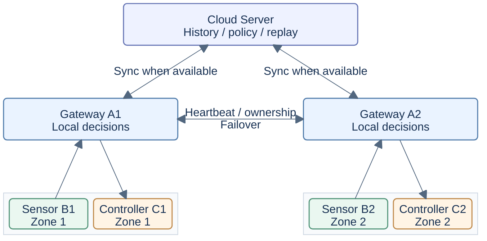

<h1 align="center">Smart Agriculture Edge AI</h1>

<p align="center"><strong>A Research Platform for Agricultural IoT and Edge AI</strong></p>

<p align="center">Trustworthy Sensing · Low-Power Communication · Safe Local Control · Reproducible Experiments</p>

---

<p align="center">An independently developed research prototype integrating embedded sensing, edge intelligence, and resilient IoT communication for smart agriculture.</p>

<p align="center">
  <a href="#项目概览">Overview</a> ·
  <a href="#系统架构">Architecture</a> ·
  <a href="#实现状态">Implementation</a> ·
  <a href="#相关研究项目">Related Projects</a> ·
  <a href="README.md">English</a>
</p>

---

## 项目概览

Smart Agriculture Edge AI 研究资源受限、网络间歇可用的农业物联网节点如何完成感知、评估数据质量，并维持本地控制。项目结合嵌入式系统、边缘 AI、自适应采样和可靠通信，面向电池供电的农田传感器，以 ESP32-S3 与 E220 LoRa 作为目标现场平台。

仓库包含可运行的七角色、双区域软件原型、ESP32-S3 传感器固件和可复现故障实验。主机原型通过真实 TCP socket 通信，感知输入与执行器动作采用模拟实现；下方的实现状态明确区分软件能力与实物测量。

> **Cloud unavailable ≠ Farm unavailable**
>
> 在本地完成感知和质量评估，在安全约束下本地决策与执行，只在信息值得通信成本时传输，并在网络恢复后同步积累的数据。云端负责历史、策略更新和未来离线学习，绝不能成为农业实时控制闭环的必需组件。

## 核心特点

- **可信感知 — SensorTrust：**按通道检查读数有效性和传感器故障。控制动作只使用满足可信条件的数据，避免无效读数授权控制。

- **自适应采样 — AdaptiveSense：**根据环境变化与传感器健康调整采样频率。采样与传输分别决策，由重要事件和控制相关变化触发上传。

- **本地边缘智能：**网关通过统一的 DecisionEngine 接口在本地作出灌溉和通风决策。默认采用规则控制，同时提供轻量学习模型供研究使用。

- **可靠通信与离线恢复：**重试、稳定消息身份、去重和持久化队列支持丢包与断网后的恢复。消息接收、执行结果和持久化存储分别记录。

- **双网关故障接管：**A1/A2 交换心跳与归属信息，存活网关可以服务两个固定区域。恢复的网关保持待机，不自动夺回控制权。

- **安全控制与云端同步：**控制器在执行前检查命令权限、新鲜度、重复情况和运行限制。网关在本地保留历史，云端同步独立于本地控制路径。

## 系统架构

### 精简系统概览

两张图展示正常归属下的完整七角色架构。传感器与控制器在区域内并列，云端承担数据同步与策略支持。



### 详细架构

<details>
<summary>展开原有七角色完整架构图</summary>

```text
                                      ┌─────────────────────────────┐
                                      │        Cloud Server         │
                                      │                             │
                                      │  • Sensor History           │
                                      │  • Node / Gateway Status    │
                                      │  • Control History          │
                                      │  • Alerts                   │
                                      │  • Policy Management        │
                                      │  • Deduplication            │
                                      │  • SQLite Persistence       │
                                      └──────────────┬──────────────┘
                                                     │
                                   telemetry / policy / replay
                                                     │
                        ┌────────────────────────────┴────────────────────────────┐
                        │                                                         │
                        ▼                                                         ▼
              ┌──────────────────────┐                                 ┌──────────────────────┐
              │      Gateway A1      │◄──── Heartbeat / Ownership ────►│      Gateway A2      │
              │                      │      Generation / Failover    │                      │
              │  • Node Registry     │                                 │  • Node Registry     │
              │  • Sensor Quality    │                                 │  • Sensor Quality    │
              │    Gate              │                                 │    Gate              │
              │  • Edge AI /         │                                 │  • Edge AI /         │
              │    DecisionEngine    │                                 │    DecisionEngine    │
              │  • ACK / Retry       │                                 │  • ACK / Retry       │
              │  • Dedup / Sequence  │                                 │  • Dedup / Sequence  │
              │  • Offline Queue     │                                 │  • Offline Queue     │
              │  • Local Autonomy    │                                 │  • Local Autonomy    │
              │  • Failover Control  │                                 │  • Failover Control  │
              └─────────┬────────────┘                                 └─────────┬────────────┘
                        │                                                         │
              ┌─────────┴──────────┐                                    ┌─────────┴──────────┐
              │                    │                                    │                    │
              ▼                    ▼                                    ▼                    ▼
     ┌─────────────────┐  ┌─────────────────┐                  ┌─────────────────┐  ┌─────────────────┐
     │    Sensor B1    │  │  Controller C1  │                  │    Sensor B2    │  │  Controller C2  │
     │                 │  │                 │                  │                 │  │                 │
     │ Physical / Sim  │  │ Command RX      │                  │ Physical / Sim  │  │ Command RX      │
     │ Sensors         │  │      ↓          │                  │ Sensors         │  │      ↓          │
     │      ↓          │  │ Receipt ACK     │                  │      ↓          │  │ Receipt ACK     │
     │ SensorTrust     │  │      ↓          │                  │ SensorTrust     │  │      ↓          │
     │      ↓          │  │ Safety Guard    │                  │      ↓          │  │ Safety Guard    │
     │ Health / Fault  │  │      ↓          │                  │ Health / Fault  │  │      ↓          │
     │      ↓          │  │ Owner / Epoch   │                  │      ↓          │  │ Owner / Epoch   │
     │ AdaptiveSense   │  │ TTL / Cooldown  │                  │ AdaptiveSense   │  │ TTL / Cooldown  │
     │      ↓          │  │ Idempotency     │                  │      ↓          │  │ Idempotency     │
     │ Sampling /      │  │      ↓          │                  │ Sampling /      │  │      ↓          │
     │ Upload Policy   │  │ Actuator        │                  │ Upload Policy   │  │ Actuator        │
     │      ↓          │  │ Execution       │                  │      ↓          │  │ Execution       │
     │ SENSOR_DATA /   │  │      ↓          │                  │ SENSOR_DATA /   │  │      ↓          │
     │ ALERT           │  │ CONTROL_RESULT  │                  │ ALERT           │  │ CONTROL_RESULT  │
     └────────┬────────┘  └────────▲────────┘                  └────────┬────────┘  └────────▲────────┘
              │                    │                                    │                    │
              └─────── Zone 1 ────┘                                    └─────── Zone 2 ────┘
```

</details>

B1/B2 评估读数并决定何时上报；A1/A2 校验数据、进行本地决策并管理交付；C1/C2 检查执行条件并返回结果；Cloud Server 保存历史、告警和策略。

**Zone 1 始终配对 B1 与 C1，Zone 2 始终配对 B2 与 C2。** A1 故障时由 A2 服务两个区域，A2 故障时由 A1 接管。网关归属可以迁移，传感器与控制器的配对不能改变。心跳与归属隔离机制支持已评估的恢复场景，不构成任意网络分区下的共识保证。

## 实现状态

**已实现**表示已有源码；**主机测试 / 模拟验证**表示工作站评估；**实物测试**必须有真实设备记录。固件编译通过不等于完成硬件系统验证。

| 能力 | 当前状态 | 待完成工作 |
| --- | --- | --- |
| 七角色双区域原型 | 已实现；通过 TCP 与模拟 LoRa 进行主机测试 | 完整现场硬件集成 |
| SensorTrust 与 AdaptiveSense | 已集成主机软件和 B1 固件；有主机测试 | 现场校准及采样、上传行为评估 |
| 本地决策与双网关接管 | 已实现；有模拟控制与主机测试 | 实物网关协调及硬件接管演示 |
| 可靠交付与离线恢复 | 已实现；样本、结果持久交付和云端回放有主机测试 | 长期断网、存储边界及实物断电评估 |
| ESP32-S3 B1 固件 | 感知、交付、Light Sleep 和实验 Deep Sleep 配置已实现并编译验证 | 当前配置的板上运行、状态恢复与功耗验证 |
| LoRa 协议与 E220 UART | 分帧与路由有主机测试；B1 UART 驱动已实现并编译验证 | 实物网关、控制器无线端点及端到端 RF 验证 |
| ESP32-S3 / SHT30 实物感知 | 已有范围有限的温湿度实物实验 | 其他传感器通道及完整无线控制闭环 |
| Edge AI 模型流程 | 合成策略模仿模型与导出工具已实现并经主机测试 | 真实农业数据、现场评估及设备推理 |
| 真实执行器与现场部署 | 计划中 / 待硬件验证 | 泵、阀或风扇，现场链路认证，能耗与电池测量 |

当前默认分支 `main` 已包含整合后的研究实现；`research` 用于后续研究开发。必要链路认证尚未完成，部署入口仍保持禁用。

## 快速开始

使用 Python 3.10 或更高版本。主机 Demo 无需硬件，节点运行时仅依赖 Python 标准库。

克隆仓库并准备环境：

```bash
git clone https://github.com/Sver0411/Smart-Agriculture-Edge-AI.git
cd Smart-Agriculture-Edge-AI
python3 -m venv .venv
source .venv/bin/activate
python -m pip install -r requirements.txt
```

在一个进程中启动全部七个角色：

```bash
python demo.py --duration 30
```

各角色通过本地 TCP socket 通信。Demo 记录感知、网关决策、模拟控制器执行和云端历史，不操作真实执行器。

可选的软件检查（完整测试还需 C11 编译器）：

```bash
python -m pytest tests/ -q
```

## 相关研究项目

这些项目独立维护，其设备测量与研究结果不等同于本仓库的系统验证。

| 项目 | 研究方向 | 仓库 |
| --- | --- | --- |
| AdaptiveSense | 变化感知采样与事件检测，研究感知、通信成本和漏检之间的权衡 | [AdaptiveSense](https://github.com/Sver0411/AdaptiveSense) |
| SensorTrust | 可移植的传感器质量评估与启发式故障检测 | [SensorTrust](https://github.com/Sver0411/SensorTrust) |
| EventGuard-LoRa | 在有界冗余和通信预算下研究 E220 链路的关键事件交付 | [EventGuard-LoRa](https://github.com/Sver0411/EventGuard-LoRa) |
| EdgeFaultLab | 确定性的 IoT 协议、进程故障注入，恢复断言与可复现轨迹 | [EdgeFaultLab](https://github.com/Sver0411/EdgeFaultLab) |
| TinyEdgeBench | 轻量模型比较、FP32/INT8 权衡及独立 ESP32-S3 资源测量 | [TinyEdgeBench](https://github.com/Sver0411/TinyEdgeBench) |
| AgriTinyVision | 轻量作物图像异常初筛、不确定性拒绝、训练、量化与导出 | [AgriTinyVision](https://github.com/Sver0411/AgriTinyVision) |

**已集成或复用：**本项目复用 SensorTrust 检测语义与 C 核心，以及 AdaptiveSense 的 Python 分析器、调度器；TinyEdgeBench 为模型与导出流程提供方法参考。EdgeFaultLab 通过适配器在外部运行，未将其引擎复制进本仓库。具体来源与复用边界见[复用报告](docs/V0_3_INTEGRATION_REPORT.md#2-reused-assets)和[来源清单](docs/integration_sources.json)。

**独立研究方向：**EventGuard-LoRa 提供设计与评估参考，其冗余策略尚未集成。AgriTinyVision 的摄像头、模型路径尚未接入本系统，现场与设备推理验证仍待完成。

## 文档与路线图

详细设计、实验方法和历史证据继续保留在 `docs/` 与 `results/` 中。

<a id="run-reproducible-fault-experiments"></a>

| 主题 | 文档入口 |
| --- | --- |
| 本地自主与现场设计 | [部署语义](docs/DEPLOYMENT_SEMANTICS.md) · [云端职责边界](docs/CLOUD_BOUNDARIES.md) |
| 网关架构与可靠性 | [传感器处理流水线](docs/architecture/AR1_SENSOR_PIPELINE.md) · [可靠性报告](docs/research/RELIABILITY_STABILIZATION_REPORT.md) |
| ESP32-S3 固件与低功耗配置 | [B1 固件](firmware/b1/README.md) · [实验传输与休眠](firmware/b1/EXPERIMENTAL_TRANSPORT_SLEEP.md) |
| LoRa 分帧与 E220 UART | [协议与 UART 实现](docs/research/PHASE2_LORA_DEVELOPMENT_REPORT.md) |
| 实验与保留证据 | [跨阶段集成](docs/research/PHASE1_2_TO_PHASE3_INTEGRATION_REPORT.md) · [历史实物感知](results/v0.3/README.md) · [证据归档](results/) |

下一步研究与工程方向：

- 完成传感器、网关和控制器的 E220 链路调试与现场会话认证。
- 在无云端连接时演示双网关硬件接管，保持固定区域配对。
- 集成真实控制器与执行器，评估故障和重启下的安全行为。
- 验证 Deep Sleep 状态恢复，测量电流、能耗与电池续航。
- 采集真实农业数据，在考虑现场部署前完成模型评估。

采用 MIT 许可证；复用组件保留原有许可证声明与来源标注。
