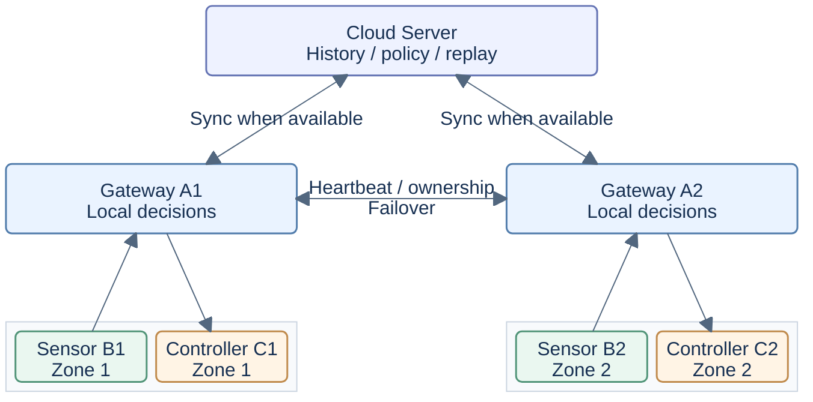

<h1 align="center">Smart Agriculture Edge AI</h1>

<p align="center"><strong>A Research Platform for Agricultural IoT and Edge AI</strong></p>

<p align="center">Trustworthy Sensing · Low-Power Communication · Safe Local Control · Reproducible Experiments</p>

---

<p align="center">An independently developed research prototype integrating embedded sensing, edge intelligence, and resilient IoT communication for smart agriculture.</p>

<p align="center">
  <a href="#项目概览">Overview</a> ·
  <a href="#系统架构">Architecture</a> ·
  <a href="#实现与验证状态">Implementation</a> ·
  <a href="#相关研究项目">Related Projects</a> ·
  <a href="README.md">English</a>
</p>

---

**整合状态：**PR #7 已记录的恢复阻塞已[修复并完成完整验证](docs/research/PR7_RECOVERY_FIX.md)。[PR #7](https://github.com/Sver0411/Smart-Agriculture-Edge-AI/pull/7) 及其[检查](https://github.com/Sver0411/Smart-Agriculture-Edge-AI/pull/7/checks)记录合入 main 的发布状态。[原始失败证据](docs/research/FINAL_BRANCH_INTEGRATION.md#publication-blocker-final-head-ci-failure)继续保留。

## 研究概览

| 主题 | 研究摘要 |
| --- | --- |
| 研究问题 | 资源受限、连接不稳定时的可信感知、选择性通信与安全本地控制 |
| 系统原型 | 两个固定农业区域、七个角色：Server、A1/A2 网关、B1/B2 传感器、C1/C2 控制器 |
| 核心方法 | SensorTrust、AdaptiveSense、控制相关上传、归属与接管、安全控制、持久化离线回放 |
| 软件验证 | **每个 Python 版本 631 项测试**；TCP **20/20**、主机模拟 LoRa **20/20**、跨阶段 **10/10**、外部 EdgeFaultLab **5/5**；[已记录结果与整合检查](#实验与结果) |
| 研究整合 | 有界 LoRa/B1 UART、实验 RTC/NVS 休眠恢复、可靠样本/结果交付、策略版本恢复及 AR-1；[源码与范围](#主分支与研究分支) |
| 实物证据 | 历史 ESP32-S3/SHT30 HW1：**30 次 CRC 有效读取**，无物理读取失败；仅验证感知。[英文证据摘要](docs/RESEARCH_EVIDENCE_GUIDE.md#b-physical-esp32-s3--sht30-evidence) |
| 当前限制 | E220 无线控制闭环、真实执行器、deep sleep、能耗/电池测量与农业效果仍未验证 |
| 相关研究 | [查看六个独立维护的研究项目](#相关研究项目)；其结果与主系统证据分开 |

## 快速导航

[项目概览](#项目概览) · [系统架构](#系统架构) · [核心研究模块](#核心研究模块) · [实现与验证状态](#实现与验证状态) · [实验与结果](#实验与结果) · [快速开始](#快速开始) · [限制与后续工作](#限制与后续工作) · [相关研究项目](#相关研究项目) · [英文研究证据导览](#英文研究证据导览)

## 项目概览

本项目研究一个具体问题：资源受限的农业节点如何判断哪些读数值得传输，并在网关故障或云端断连时维持受安全约束的本地控制。农业物联网提供了明确的应用背景：环境通常缓慢变化，重要事件偶尔出现，传感器依赖电池供电，而控制决策同时依赖数据质量与新鲜度。

完整原型包含七个角色：Server、A1/A2 网关、B1/B2 传感器节点和 C1/C2 控制节点。它们可以在一台电脑上通过真实 TCP socket 通信，传感器输入与执行器动作使用模拟实现。节点运行时仅依赖 Python 标准库。仓库还包含 ESP32-S3 B1 固件和范围有限的实物感知记录；系统级无线控制与能耗评估仍待完成。

## 研究动机

- **低功耗感知**：频繁采样和无线通信都会占用电池预算。采样与上传应分别决策，同时需要观察重要环境变化。
- **无线通信可靠性**：丢失、重复、延迟和断网使“成功发送”与“收到、执行、持久化”成为不同状态，每个阶段都需要独立的消息身份和证据。
- **控制数据的新鲜度**：旧读数即使数值有效，也不能授权新动作。网关归属、generation、sequence 和命令过期检查共同约束区域控制。
- **本地自主能力**：云端是否在线不应决定现场能否执行安全、有限的本地动作。网关本地决策，控制器在执行前检查命令。
- **可复现评估**：故障注入、固定随机种子、原始事件和机器断言，使失败行为可以检查和复现。这些证据验证指定的软件场景，本身不代表农业效果或已成立的科研创新。

## Project North Star — Do Not Drift

**这是长期设计约束；以后 README 重构不得删除或弱化本章节。**

项目的目标不是“把所有农业传感器数据实时发送到服务器”。真正目标是：

> 在电池供电、弱网甚至完全没有互联网连接的农业环境中，让各节点在本地完成感知、判断和控制，只在信息值得通信成本时才传输，并在网络恢复后再与云端同步。

```text
Sense locally
    ↓
Evaluate locally
    ↓
Transmit only when necessary
    ↓
Decide locally
    ↓
Act locally
    ↓
Sync when connectivity allows
    ↓
Learn from accumulated field data

Cloud unavailable ≠ Farm unavailable
```

Cloud Server 是增强层，绝不能成为现场实时控制闭环的必要组成部分。A 在本地作判断，C 安全执行；Cloud 用于历史、同步、策略增强和未来离线训练。

## 系统架构

### 精简系统概览

下图是**主机软件拓扑**：TCP 通信，模拟传感器输入与执行器动作。B1/C1、B2/C2 是固定区域配对；网关位置表示正常归属。任一网关故障后，另一网关可以服务两个区域，具体路径见下表。有界 LoRa 分帧与 B1 E220 UART 驱动已有实现；完整 A/C 实物端点与 RF 验证仍待完成。



### 两个农业区域与网关归属

Zone 1 固定对应 **B1 与 C1**，Zone 2 固定对应 **B2 与 C2**。每个区域都有完整的 Sensor B、Gateway A 和 Controller C。A1/A2 交换心跳，并在连接可用时与云端同步。下图展示两个区域的正常部署关系，两者都是系统的完整组成部分。

| 运行状态 | Zone 1 | Zone 2 |
| --- | --- | --- |
| 正常运行 | B1 → A1 → C1 | B2 → A2 → C2 |
| A1 故障 | B1 → A2 → C1 | B2 → A2 → C2 |
| A2 故障 | B1 → A1 → C1 | B2 → A1 → C2 |

**网关归属可以迁移，区域成员关系不能改变。** `CONTROLLER_OF_SENSOR` 中的 B1→C1、B2→C2 始终固定。接管依赖 OwnershipManager、心跳超时、generation/epoch、注册和旧命令拒绝机制。恢复的网关进入 STANDBY，不自动切回。

### 详细架构

<details>
<summary>展开原有七角色完整架构图</summary>

```text
                                      ┌─────────────────────────────┐
                                      │        Cloud Server         │
                                      │                             │
                                      │  • Sensor History           │
                                      │  • Node / Gateway Status    │
                                      │  • Control History          │
                                      │  • Alerts                   │
                                      │  • Policy Management        │
                                      │  • Deduplication            │
                                      │  • SQLite Persistence       │
                                      └──────────────┬──────────────┘
                                                     │
                                   telemetry / policy / replay
                                                     │
                        ┌────────────────────────────┴────────────────────────────┐
                        │                                                         │
                        ▼                                                         ▼
              ┌──────────────────────┐                                 ┌──────────────────────┐
              │      Gateway A1      │◄──── Heartbeat / Ownership ────►│      Gateway A2      │
              │                      │      Generation / Failover    │                      │
              │  • Node Registry     │                                 │  • Node Registry     │
              │  • Sensor Quality    │                                 │  • Sensor Quality    │
              │    Gate              │                                 │    Gate              │
              │  • Edge AI /         │                                 │  • Edge AI /         │
              │    DecisionEngine    │                                 │    DecisionEngine    │
              │  • ACK / Retry       │                                 │  • ACK / Retry       │
              │  • Dedup / Sequence  │                                 │  • Dedup / Sequence  │
              │  • Offline Queue     │                                 │  • Offline Queue     │
              │  • Local Autonomy    │                                 │  • Local Autonomy    │
              │  • Failover Control  │                                 │  • Failover Control  │
              └─────────┬────────────┘                                 └─────────┬────────────┘
                        │                                                         │
              ┌─────────┴──────────┐                                    ┌─────────┴──────────┐
              │                    │                                    │                    │
              ▼                    ▼                                    ▼                    ▼
     ┌─────────────────┐  ┌─────────────────┐                  ┌─────────────────┐  ┌─────────────────┐
     │    Sensor B1    │  │  Controller C1  │                  │    Sensor B2    │  │  Controller C2  │
     │                 │  │                 │                  │                 │  │                 │
     │ Physical / Sim  │  │ Command RX      │                  │ Physical / Sim  │  │ Command RX      │
     │ Sensors         │  │      ↓          │                  │ Sensors         │  │      ↓          │
     │      ↓          │  │ Receipt ACK     │                  │      ↓          │  │ Receipt ACK     │
     │ SensorTrust     │  │      ↓          │                  │ SensorTrust     │  │      ↓          │
     │      ↓          │  │ Safety Guard    │                  │      ↓          │  │ Safety Guard    │
     │ Health / Fault  │  │      ↓          │                  │ Health / Fault  │  │      ↓          │
     │      ↓          │  │ Owner / Epoch   │                  │      ↓          │  │ Owner / Epoch   │
     │ AdaptiveSense   │  │ TTL / Cooldown  │                  │ AdaptiveSense   │  │ TTL / Cooldown  │
     │      ↓          │  │ Idempotency     │                  │      ↓          │  │ Idempotency     │
     │ Sampling /      │  │      ↓          │                  │ Sampling /      │  │      ↓          │
     │ Upload Policy   │  │ Actuator        │                  │ Upload Policy   │  │ Actuator        │
     │      ↓          │  │ Execution       │                  │      ↓          │  │ Execution       │
     │ SENSOR_DATA /   │  │      ↓          │                  │ SENSOR_DATA /   │  │      ↓          │
     │ ALERT           │  │ CONTROL_RESULT  │                  │ ALERT           │  │ CONTROL_RESULT  │
     └────────┬────────┘  └────────▲────────┘                  └────────┬────────┘  └────────▲────────┘
              │                    │                                    │                    │
              └─────── Zone 1 ────┘                                    └─────── Zone 2 ────┘
```

</details>

A1/A2 是边缘网关，B1/B2 是传感器节点，C1/C2 控制对应区域。B 与 C 并列：B1 的读数始终用于控制 C1，接管后也保持这一关系。Server、Controller 和网关可靠性机制都位于本仓库。

## 核心研究模块

以下模块已在当前 research 整合准备版本中实现；具体证据等级与验证边界见下一节。

| 模块 | 在研究原型中的作用 | 源码 |
| --- | --- | --- |
| SensorTrust | 按通道检查有效性、健康状态和 RANGE/STUCK/SPIKE/DRIFT/MISSING，按控制动作选择可信通道 | [传感器健康](sensor_node/sensor_trust.py)、[网关可信门控](gateway/trust_gate.py) |
| AdaptiveSense | 变化评分、STABLE/ACTIVE/ALERT 状态、滞回、采样周期阶梯与选择性上传 | [采样策略](sensor_node/adaptive_sense.py) |
| 控制相关上传 | 上报可信通道的阈值跨越或进入阈值邻域；执行器决策仍由网关负责 | [相关性门控](sensor_node/control_relevance.py) |
| 网关归属与故障接管 | 固定区域关系，通过心跳和 generation 检查迁移归属；恢复网关保持 STANDBY | [归属管理](gateway/ownership.py) |
| 可靠消息与去重 | 稳定命令身份、有限重试，分别跟踪接收、结果与持久化；Server 事务内去重 | [可靠通信](common/reliability.py)、[Server](server/server.py) |
| 安全边缘控制 | 串行模拟执行，检查 owner/epoch/TTL、冷却时间，并持久化有界的执行意图与结果窗口 | [安全守卫](controller_node/safety_guard.py)、[近期命令](controller_node/recent_commands.py) |
| 离线队列与恢复 | 文件型 SQLite outbox、HIGH 准入保留容量、FIFO 回放；仅凭 PERSISTED_ACK 删除 | [离线队列](gateway/offline_queue.py) |
| Edge AI | 可切换的 Rule、Logistic、Tree、MLP 引擎，以及可复现的合成策略模仿参考 | [决策引擎](ai/engines/)、[训练](ai/train.py) |
| 故障注入与可复现实验 | 七角色主机实验、可审计指标，以及独立 EdgeFaultLab 的运行适配器 | [实验框架](experiments/runner.py)、[外部适配器](experiments/edgefaultlab.py) |
| 传感器准备（AR-1） | 纯记录、可信度、年龄/boot 资格与告警准备；Gateway 保留事务、ACK、实时归属与调度 | [pipeline](gateway/sensor_pipeline.py)、[架构](docs/architecture/AR1_SENSOR_PIPELINE.md) |
| 有界现场传输与休眠 | 主机 LoRa 编解码/重组、B1 E220 UART、可选 RTC 快照/NVS HIGH 保留；硬件调试待完成 | [LoRa](common/lora/)、[固件配置](firmware/b1/EXPERIMENTAL_TRANSPORT_SLEEP.md) |
| 可靠结果与策略发布 | 稳定控制结果重放、范围化持久回执与 Server 持久策略版本 | [控制器存储](controller_node/recent_commands.py)、[Server 数据库](server/database.py) |

## 实现与验证状态

**已实现**表示当前分支包含相应源码；**主机测试**表示有工作站测试或软件故障实验；**固件编译通过**表示 ESP-IDF 构建成功，不等于板上运行；**实物测试**必须有真实设备记录；**已设计 / 计划中 / 待验证**表示已定义的契约或后续工作。多个等级可以同时成立，不能相互替代。

| 能力 | 当前证据等级 | Pending / 边界 |
|---|---|---|
| SensorTrust | Host Tested / Firmware Implemented；历史 HW1 正常读数 | 故障阈值农田校准 |
| AdaptiveSense | Host Tested / Software Experimentally Evaluated / Firmware Implemented | 新语义硬件重验、真实环境事件 |
| B upload policy | Host Tested Python/C 逐 sample + queue/sink / Firmware Implemented | 新固件 radio 上传实测 |
| Physical SHT30 | Hardware Tested，历史 30 次 CRC 正常读取 | 本轮未刷板；温湿度以外通道未测 |
| B low-power runtime | Host/C 快照测试；包括实验 Deep Sleep 的四种配置编译通过 | 校准 RTC elapsed、GPIO/无线休眠、NVS 断电、电流与电池测量 |
| B↔A LoRa | 有界 Host 协议测试；B1 E220 UART 源码编译通过 | 实物 Gateway 端点、RF 调试与端到端测量 |
| A DecisionEngine | Host Tested / Software Experimentally Evaluated | MCU port、真实农业效果 |
| A1/A2 heartbeat | Host Tested / Software Experimentally Evaluated | 本地无线硬件链路 |
| Gateway failover | Host Tested / Software Experimentally Evaluated | 整套硬件展示，无自动 failback |
| A↔C LoRa | 主机拓扑、路由及控制 fencing 测试 | 实物 A/C E220 端点与 RF 测量 |
| C actuator | Host Tested 安全守卫 / 模拟执行 | relay / pump / fan 真实执行 |
| Cloud offline replay | 样本/结果持久化回执、FIFO 回放、策略版本恢复的 Host 测试 | 长期容量与断电评估 |
| Dashboard | Designed | HTTP API / frontend 未实现 |
| real-data training | Designed；synthetic 工具 Host Tested | 现场数据、标签、GPU、registry |

[HW1 记录](results/v0.3/README.md)包含 30 次 CRC 有效的 SHT30 读取，没有物理读取失败。当时 Wi-Fi 未配置，未观察到网关上传，也没有注入环境故障。因此它验证的是一次感知运行，尚不能证明完整 B→A→C 闭环、修订上传策略、LoRa、功耗或接管能力。[五项补丁记录](results/final-five-patches/README.md)另外保存了 ESP-IDF v5.4.4 的 lab/deployment 编译证据，包括可选 light sleep；该轮构建没有烧录验证。

### 主分支与研究分支

本文描述由 `research`（`f5c2710`）与 `main`（`08f573f`）形成的统一实现。整合保留 main 的学术展示、中英文文档、架构图和证据导航，采用最新 research 源码与完整 CI 矩阵。[最终分支整合记录](docs/research/FINAL_BRANCH_INTEGRATION.md)列出输入版本、分支审计和验证状态。

Phase 1/1.1 引入有界 B1 HIGH 保留与持久化确认；Phase 1.2–3 补强注册/新鲜度，实现有界 LoRa 分帧、B1 UART 驱动和默认关闭的 RTC/NVS 休眠恢复。稳定化增加控制结果持久化重发、Server 策略版本恢复、传感器确认模式与无线调度。AR-1 在保持行为的前提下分离纯传感器准备与 Gateway 协调。这些能力形成 research 基线；已记录的恢复阻塞已单独修复并验证，发布到 main 仍要求最终完整 CI。历史报告仍保留当时范围。

| 开发线 | 整合后的作用 | 证据边界 |
| --- | --- | --- |
| `main` | 发布线；PR #7 记录 research 发布及最终检查 | 历史 350 项验收及 HW1 感知与本次集成验证分开保留 |
| `research` | 当前功能与 main 文档的整合版本，包含已验证的 PR #7 恢复修复 | 完整 Python 3.10/3.12、集成实验及四种 ESP32-S3 CI 构建通过；原始失败保留 |

详见[跨阶段集成](docs/research/PHASE1_2_TO_PHASE3_INTEGRATION_REPORT.md)、[可靠性稳定化](docs/research/RELIABILITY_STABILIZATION_REPORT.md)、[AR-1 架构与验证](docs/architecture/AR1_SENSOR_PIPELINE.md)。固定 seed 无线比较保留 **43 COMPLETE / 13 INCOMPLETE**，56 项安全检查均通过。隔离实验可用 peer HMAC，但所有必要链路认证前，deployment 入口仍 fail-closed。源码整合不构成硬件成果。

## 实验与结果

### 英文研究证据导览

[英文研究证据导览](docs/RESEARCH_EVIDENCE_GUIDE.md)按明确版本链接历史 main 验收、HW1 实物记录、Phase 1–3 开发、稳定化和 AR-1 证据。[最终整合记录](docs/research/FINAL_BRANCH_INTEGRATION.md)区分本次重新执行的检查与历史评估。同一测试套件在不同 Python 版本重复运行，数量不累加。

### 主分支最近一次软件验收

当前整合检查见[最终整合记录](docs/research/FINAL_BRANCH_INTEGRATION.md)。下表是本次采用的功能源码在此前 AR-1 阶段的验收记录，与新一轮整合或硬件测量分开。

最近一次完整 AR-1 回归验证的功能源码为 `add9d076a04670b63b643fb822cfa84b23e99975`。最终报告版本 `825bb92` 的 [push CI](https://github.com/Sver0411/Smart-Agriculture-Edge-AI/actions/runs/37880089604) 和 [PR CI](https://github.com/Sver0411/Smart-Agriculture-Edge-AI/actions/runs/37880093415) 均完整通过，功能源码和配置 hash 与本地验收一致。[AR-1 记录](docs/architecture/AR1_SENSOR_PIPELINE.md)与[稳定化报告](docs/research/RELIABILITY_STABILIZATION_REPORT.md)说明了验证范围、来源和保留的失败过程。

| 评估 | 已记录结果 | 范围 |
| --- | --- | --- |
| 完整 pytest，Python 3.10 / 3.12 | 每个版本各 631 项通过 | 全部原有 587 项与 AR-1 新增 44 项；不跨解释器累加 |
| 基准与重构行为对照 | 256/256 一致 | 使用真实处理函数比较记录、命令、顺序状态、日志、指标和审计 |
| 原有 TCP 故障场景 | 20/20 PASS | 七角色主机拓扑与模拟执行器 |
| 重复归属与可靠性场景 | 20/20 PASS | 旧 generation ×10、接管 ×3、恢复 ×3，以及其他四种故障 |
| 主机模拟 LoRa 全拓扑 | 20/20 PASS | 真实应用逻辑通过模拟 RF 载体通信 |
| 固定 seed LoRa 比较 | 56/56 安全检查通过 | 43 COMPLETE、13 INCOMPLETE；未确认记录继续保留 |
| 实际 C 休眠恢复参考 | 19/19 PASS，2800 次观察 | 已知 elapsed oracle 与未知时间保守恢复；不是物理 RTC 实测 |
| 跨阶段集成 / 外部 EdgeFaultLab | 10/10 与 5/5 PASS | 生产 C/应用路径与独立故障运行器 |
| GitHub Actions | push 和 PR 均 6/6 job 通过 | 两种 Python、完整实验矩阵和四种固件构建 |
| ESP32-S3 固件 | ESP-IDF v5.4.4 下四种配置编译通过 | lab、light-sleep、lora-prototype、deep-sleep-experimental；编译不等于板上实验 |

以下保留更早的 main 350 项验收，作为历史基线。

[分支整合审查](docs/BRANCH_INTEGRATION_REVIEW.md)记录了 `main` 历史 350 项验收。功能源码版本为 [`f204ad9`](https://github.com/Sver0411/Smart-Agriculture-Edge-AI/commit/f204ad9)；归档 CI 验证的是 [`002e26a`](https://github.com/Sver0411/Smart-Agriculture-Edge-AI/commit/002e26a)，功能源码相同，另有文档更新。此后仅更新证据的提交不代表重新执行了实验。

| 评估 | 已记录结果 | 可追溯证据 |
| --- | --- | --- |
| 完整主机测试 | 本地 Python 3.10、3.12、3.14 分别通过 350 项 | [命令与环境](results/main-integration-review/validation/acceptance.json)、[本地日志](results/main-integration-review/validation/full-local.log) |
| 内部软件故障场景 | 20/20 PASS | [场景汇总](results/main-integration-review/software-scenarios/suite_summary.json) |
| 经本仓库适配器运行的外部 EdgeFaultLab 场景 | 5/5 PASS | [场景汇总](results/main-integration-review/edgefaultlab/suite_summary.json) |
| Main CI | Python 3.10/3.12 各通过 350 项；Python 3.12 通过 20 个内部与 5 个外部场景 | [CI 运行](https://github.com/Sver0411/Smart-Agriculture-Edge-AI/actions/runs/37734482845)、[归档元数据](results/main-integration-review/validation/main-ci.json) |

内部场景覆盖正常与完整控制链路，数据/ACK/结果丢失，重复、延迟和重排，传感器故障，网关接管与恢复，过期 generation，Server 离线与回放，策略回放，split brain，命令过期，注册竞争，持久化 ACK 丢失，以及控制器不可用。外部场景覆盖网关故障、Server 离线、重复控制、旧命令与命令丢失。这些是模拟执行器和受控故障下的主机软件观察，不是 RF 或实物执行器测量。[源码清单](results/main-integration-review/validation/source-manifest.json)记录了源码版本、hash、seed 和外部仓库版本。

### 历史基线与模型参考

历史 v0.3 / v0.3.1 实际运行结果（后续部署语义工作另见[部署语义报告](docs/DEPLOYMENT_REALIGNMENT_REPORT.md)）：

- v0.3 基线 155 个测试保留；v0.3.1 共 **231 个测试通过**，Python 3.10/3.12 [CI 通过](https://github.com/Sver0411/Smart-Agriculture-Edge-AI/actions/runs/37177748586)。实际命令和证据见[可靠性报告](docs/V0_3_1_RELIABILITY_REPORT.md)。
- **20/20 内部场景通过**：原 17 个场景及 registration-race、persisted-ack-loss、controller-unavailable。
- 独立 EdgeFaultLab 5/5 通过，已移除适配器 startup delay。v0.3 的首次失败记录与后续回归过程保留。
- SensorTrust Python/C 共享轨迹继续在主机端测试；该轮没有硬件操作。
- 三个 FP32 导出在 240 条留出样本上与训练器预测一致；相同 seed 的四个训练/导出文件逐字节复现。
- INT8 权重存储参考：Logistic 有 2/240 条预测与 FP32 不一致，MLP 为 0/240。激活与 bias 保持浮点、推理先反量化，尚无整数内核或设备结果。

新软件能力的验证等级为 **host-tested / software experimentally evaluated**。历史 B1 固件和实验记录保留在 [firmware/b1](firmware/b1/README.md) 与 [results/v0.3](results/v0.3/README.md)，其验证范围独立于这些软件结果。

## 快速开始

使用 Python 3.10 或更高版本；CI 验证 Python 3.10 和 3.12。

```bash
python3 -m venv .venv
.venv/bin/pip install -r requirements.txt
.venv/bin/python demo.py --duration 30
.venv/bin/python -m pytest tests/ -q
```

每个角色也有独立 CLI。分别打开终端，激活虚拟环境后运行各节点：

```bash
source .venv/bin/activate
python -m server.server --port 9100 --db server.db
python -m gateway.gateway --id A1 --engine rule
python -m gateway.gateway --id A2 --engine rule
python -m sensor_node.sensor_node --id B1
python -m sensor_node.sensor_node --id B2
python -m controller_node.controller_node --id C1
python -m controller_node.controller_node --id C2
```

demo 保留正常、故障接管、Server 离线场景，以及旧命令和重复命令注入。正式实验使用独立配置、端口和数据库。验证传感器持久化确认时，为 B 指定 `--delivery-mode gateway-durable`，为 Gateway 指定文件型 `--queue-db`；默认仍为 `legacy-write` 兼容模式。

### 运行可复现故障实验

```bash
python -m experiments.runner --all --output .research-runs/tcp-NEW
python -m experiments.reliability_stabilization --output .research-runs/repeats-NEW
python -m experiments.runner --all --transport simulated-lora --output .research-runs/lora-NEW
python -m experiments.lora_harness --seed 42 --output .research-runs/radio-NEW
python -m experiments.snapshot_harness --output .research-runs/snapshot-NEW
python -m experiments.phase123_integration --seed 42 --output .research-runs/integration-NEW

git clone https://github.com/Sver0411/EdgeFaultLab ../EdgeFaultLab
git -C ../EdgeFaultLab checkout c7248239f456cc877114ca1e67c5949fb4a7b958
python -m experiments.edgefaultlab --edgefaultlab-root ../EdgeFaultLab --output .research-runs/external-NEW
```

同一机器上的两种 Python 完整测试应串行运行，因为部分 e2e 测试使用固定端口。Host C 测试需要 C11 编译器，适用的 sanitizer 检查包含在 pytest 内。EdgeFaultLab 保持外部维护，固定到审查版本。核心断言失败会返回非零退出码。

实验保留配置、注入计划、原始事件、指标、汇总，以及源码和配置 hash；输出目录拒绝覆盖，CI 也保留失败 Artifact。指标区分 `null / not measured` 与 `0 / observed`，并分别记录接收、ACK、执行结果和持久化。已有科研证据保留，新生成数据写入 `.research-runs/` 或 CI Artifact。

## 从采样到控制结果

```text
SensorSource → SensorTrust → AdaptiveSense → SENSOR_DATA / ALERT
                                               ↓
Gateway: quality gate → DecisionEngine → CONTROL_COMMAND
                                               ↓
Controller: ACK → SafetyGuard → simulated execution → CONTROL_RESULT
                                               ↓
Gateway: live upload / SQLite OfflineQueue → Server: atomic dedup + history
```

- **SensorTrust** 按通道维护 RANGE、STUCK、SPIKE、DRIFT、MISSING，输出 `health_score`、`fault_flags` 和 HEALTHY/DEGRADED/FAULT。DRIFT 按每秒变化率计算。读数有效性独立于故障分数；即使 MISSING 尚未确认，无效数据也不能授权控制。
- **可信要求随动作变化**：Rule 灌溉需要可信土壤湿度，通风需要可信温度。不相关通道故障不阻断独立动作。Logistic、Tree、MLP 要求四通道全部有效且 HEALTHY。总体健康与故障历史仍会保存；健康状态或故障签名变化时发送 ALERT，每 300 秒提醒一次，恢复时通知。
- **AdaptiveSense** 使用归一化 EMA/STD/ROC 评分与 STABLE/ACTIVE/ALERT 状态机。升级立即发生，降级结合滞回逐级进行，采样周期沿阶梯调整。首次有效样本、状态或周期变化、事件开始与恢复、有效数据显著变化和低频上传心跳可触发上传。异常读数不参与环境变化评分，恢复后重建环境基线。
- **采样与连接维护分离**：Python SensorNode 是主机模拟配置，socket 接收、秒级 NODE_STATUS 和采样独立运行，用于协议、CI、接管和故障测试。电池现场节点的目标是间歇通信，避免每几秒发送在线心跳。**模拟时序不等于部署时序。**
- **DecisionEngine** 为 Rule、Logistic、Tree、MLP 提供统一的 `predict(sample, policy)` 接口，默认使用 Rule。其他模型是固定 seed 训练的合成策略模仿参考，用于训练、导出和引擎切换验证，尚未通过真实农业数据验证。特征顺序和版本固定在 `ai/features.py`。

## 可靠性与安全

- B/C 注册和连接路由共同确定节点连接、owner 与 generation；来源不一致或旧 generation 会被拒绝。
- 节点在线判断、重试、冷却和样本年龄使用单调时钟；协议时间戳和历史记录保留墙上时钟。客户端时间戳不决定在线状态。可靠与物理样本的五秒控制新鲜度包含网关内部排队时间，并要求 boot 与注册值一致；持久化准入及 ACK 等待之后、实际决策之前，再次检查年龄。
- 可靠样本在丢失、缓冲和重启后保留原 boot/sequence 身份。Gateway 先将回执和历史提交到文件型 SQLite outbox，再发送 `GATEWAY_OUTBOX` 范围的 PERSISTED_ACK。重复重传可以重新确认，但不产生额外回执或控制决策。旧 boot、过期或年龄未知的可靠样本仅作为历史。
- Host SensorNode 保留 `legacy-write` 兼容模式，并提供可选的 `gateway-durable` 模式。后者将 HIGH 待确认记录写入 checkpoint，NORMAL 仍只保留在 RAM；只有匹配的持久化 ACK 才推进上传基线。旧 boot 历史的确认只清退旧记录，不确认新 boot 基线。
- CONTROL_COMMAND 保持稳定的 `message_id`/`command_id`，ACK 重试有界，控制器按身份幂等处理。命令 ACK 仅确认接收，CONTROL_RESULT 才报告执行。结果缺失时记为 UNKNOWN，迟到结果可以消除不确定性；不能发起新动作来修复结果丢失。
- Controller 串行处理命令。SafetyGuard 检查类型、身份、TTL、owner/generation、重复、执行时长和冷却时间；意图与结果 checkpoint 支持保守恢复。CONTROL_RESULT 使用有界持久化重发窗口，保留原始消息内容，由 `CONTROL_RESULTS` 范围的持久化 ACK 清退。Gateway 提交结果回执、历史和 outcome 后才确认。
- 心跳超时触发接管并提高 generation，恢复的网关保持 STANDBY，不自动切回。故障检测器区分本地监视任务暂停与远端失联；这一机制不是任意分区下的共识协议。
- 云端上传使用有界 SQLite outbox、HIGH 容量保留、稳定身份、FIFO 回放和 Server 事务去重；commit 后才发送 ACK。重连与回放由独立任务处理。无效上传不占用身份，ACK 丢失时保留记录，供去重重传。
- 过期、控制器不可用或失去控制权的未发送命令记为 NOT_DISPATCHED；可能已发送的命令可以保持 UNKNOWN。现场命令不会积压到故障恢复后再执行。
- SERVER_POLICY 先验证内容与版本，再持久化激活。Gateway 恢复最后有效策略；Server 将发布内容和版本一起持久化，避免重启后版本归零。未改变内容或重复广播不生成新版本。策略 ACK 仍只确认接收，不构成保证重试契约。
- A1/A2 的隔离实验可使用 HMAC 会话，但 B↔A、A↔C、云端和实物 RF 链路尚未形成完整认证会话。因此 `profile=deployment` 即使配置了有效 peer key，也会在启动前被拒绝。CRC 只能验证完整性，不能认证身份。

### 协议兼容

TCP 上使用逐行 JSON，原有六字段 envelope 保持兼容：

```json
{"type":"SENSOR_DATA","source":"B1","target":"A1","timestamp":1234567890.0,"message_id":"sample-001","payload":{}}
```

可选字段为 `protocol_version:1`、`sequence`、`attempt`、`generation`；未携带时按旧协议处理。新模拟传感器使用 boot_id + sequence 区分逻辑采样；重排/重复旧数据可保留用于审计，但不再驱动新控制。解析拒绝非有限/溢出数字、错误字段类型、不支持的版本和超长帧。Gateway 与 Server 需配套升级：旧 Server 无持久化确认时，新网关保留 outbox 副本。JSON envelope 和 LoRa CRC 不认证 B/C/云端身份；可选 peer HMAC 仅覆盖 A1/A2 实验，完整认证前禁止 deployment。

## 配置与时序

`config/software.json` 定义软件基线与完整拓扑，由 `common/settings.py` 校验，`common/config.py` 保留兼容常量。独立进程可通过 `SMART_AGRICULTURE_CONFIG=/path/config.json` 选择基线；构造器覆盖值和实验 `runtime_overrides` 写入实验配置。

`config/profiles/` 分别配置采样、上传与云端重连：

| 配置 | STABLE | ACTIVE | ALERT | 稳定状态上传心跳 |
| --- | --- | --- | --- | --- |
| simulation | 20→40→60 s | 15→10→5 s | 5 s | 60 s |
| lab | 2→4→5 s | 2→1 s | 1 s | 300 s |
| deployment | 20→40 min | 10→5 min | 5→2→1 min | 6 h |

部署数值是**工程默认值**，不代表允许安全部署；需要结合作物特性、传感器噪声、环境变化、电池测量和农田试验校准。阈值、EMA 窗口、事件持续时间与故障提醒也可配置；部署配置改变的不只是一个休眠间隔。

`config/physical_b1.json` 显式保留历史温湿度 SensorTrust 设置。运行 `python scripts/generate_b1_profiles.py` 生成 B1 的 C 参数，或使用 `--check` 检查生成配置是否过期。

Python/C 上传决策一致性测试向两端提供相同输入，逐样本比较状态、下一采样间隔、事件检测和上传请求，覆盖稳定、缓慢变化、突变、事件开始/恢复、传感器故障、周期上传和大幅变化。这是共享轨迹上的测试证据，不是所有浮点边界下的数学证明。

## 离线模型工具

额外依赖仅用于离线训练；运行节点不需要 sklearn 或 numpy。

```bash
pip install -r requirements-training.txt
python -m ai.train --seed 42 --output ai/artifacts
python -m ai.quantize --output ai/artifacts/int8
python -m ai.benchmark --output model_benchmark.json
```

`ai.train.train(..., rows=feature_label_rows)` 可以接收外部特征/标签行，输出标为 `user-provided-unvalidated`，为后续替换数据提供入口。导出记录训练/留出划分、数据 hash、seed、特征版本与来源。

Logistic 在合成留出集上有 10/240 条策略模仿误差。该负面结果被保留，不能作为农业有效性评估。主机延迟和 JSON 字节数也不能用作 MCU 延迟、Flash 占用或能耗测量。

## Sensor B 的现场部署语义

> Sense locally and communicate only when information is worth the energy.

```text
Wake → Read Sensors → SensorTrust → AdaptiveSense → Update local state
    → Decide next sampling interval → Decide whether transmission is necessary
        ├── NO  → Sleep
        └── YES → Wake radio → LoRa → A → Radio sleep → Sleep
```

**sampled != transmitted**。B1 的 upload_requested 现在完整传递至 sample、发送队列和 transmission guard；稳定采样不再每次入队。communication events 来自首次有效 sample、重要状态变化、确认事件开始/恢复、大 delta、健康故障变化、低频健康报告及配置认可的 critical condition。故障签名不变时不重复发送每个异常 sample。

**Low-Power Communication**：Control-relevant threshold crossing is an immediate upload trigger. 轻量 ControlRelevanceGate 仅比较可信通道与上次成功发送/入队值，双向识别 soil `< threshold`、temperature `> threshold`；profile margin 可配置进入阈值邻域的额外上报。`upload_reasons` 保存所有触发原因。不可信通道走 sensor fault；不相关通道故障不掩盖可信温度 crossing。最终控制仍由 A 决定。

B1 的实物感知仍是 SHT30 温度与湿度；土壤湿度控制相关性目前只在主机原型验证。

当前 `firmware/b1` 的 ESP32 Wi-Fi/TCP 是 **Development / Integration Transport**，保留其硬件整合价值。SensorTrust/AdaptiveSense 不知道 socket；`b1_telemetry.c` 构造业务 payload，`b1_transport.h` 提供 sink，`b1_network.c` 是 TCP/Wi-Fi adapter。Python `SensorRuntime` 与 `MockFieldTransport` 在 host 验证 radio wake/send/sleep 路径；Python TCP SensorNode 只接受 simulation/lab，不能把 deployment 的分钟周期配在秒级在线 keepalive 上冒充电池部署。

lab/light-sleep 保留 Wi-Fi/TCP 集成。research 的 E220 驱动已实现有界 UART/AUX 通信窗口，以及空队列变为非空或 HIGH 准入时的通知调度与断链退避。UART 写入完成不等于远端收到；只有匹配的网关持久化 ACK 才能清退可靠记录。无线唤醒/休眠、AUX 时序和 RF 行为仍需实测。

Phase 3 已提供默认关闭的 Deep Sleep 任务、RTC 算法快照和 NVS HIGH 恢复，并用实际 C 实现验证 SensorTrust/AdaptiveSense 连续性。默认 elapsed provider 返回 UNKNOWN，固件保守重建时间与上报基线，不把计划休眠时间当作实测值。每次唤醒使用新 boot 身份，旧 HIGH 保留原身份。详见[休眠配置与调试要求](firmware/b1/EXPERIMENTAL_TRANSPORT_SLEEP.md)。板上连续性、电流和电池寿命仍未测量。

现场目标是 **ESP32-S3 + E220 LoRa**，用于 B↔A、A↔C；A1↔A2 coordination 也必须独立于 Internet/Cloud/Wi-Fi AP。有界分帧/重组、角色路由、重试和 B1 UART 驱动已有源码及主机测试或编译证据；Gateway/Controller 实物 E220 端点、完整无线注册、归属通知与心跳集成仍待硬件工作。**Field LoRa Semantics**：B belongs to a Zone, not permanently to a Gateway. Uplink 携带 source_node_id、zone_id、sequence、boot/session id、payload；只有当前 Zone owner 可以驱动固定 C。Gateway 层检测 failover，B 不持续监听两个 A 或发送高频 probe。TCP fallback 是 host integration behavior；最终 LoRa 可以按 Zone 上行，B 不必改自己的 Zone 或先改目的 Gateway。必要的本地策略/epoch 交换在通信窗口完成，最终时序需硬件验证。

## Gateway A 的本地自主与弱网同步

本地路径始终是 receive B → validate / Trust Gate → DecisionEngine → CONTROL_COMMAND → C → CONTROL_RESULT。[sensor_pipeline](gateway/sensor_pipeline.py) 用纯函数准备记录、信任、新鲜度和告警；Gateway 保留顺序/boot 状态、SQLite 准入、ACK、实时控制权、generation 和命令派发，原有处理接口保持可用。Cloud reconnect 与 outbox replay 使用独立任务；慢回执也不会挡住新历史的本地落盘和 B→A→C。

Cloud connectivity 分为 ONLINE、DEGRADED、OFFLINE；deployment 重连退避为 5/15/30/60/300 s，simulation/lab 各有独立参数。恢复后按配置节流回放，仍由每条 PERSISTED_ACK 删除；显式 CRITICAL event 可触发一次受 cooldown 限制的提前重连。连接状态和 outbox depth/bytes/oldest age/rejections 随 Gateway heartbeat 保存在 Cloud 历史。heartbeat 的 host TCP 实现不能证明现场在 Wi-Fi AP 断开后仍工作。

**Offline Queue**：critical capacity is reserved。默认 10,000 条 / 16 MiB 中，为 HIGH 保留 1,000 条 / 1,677,722 bytes；NORMAL 到保留边界即拒绝，HIGH 可继续进入总容量。CONTROL_RESULT、CRITICAL、命令投递失败、Gateway takeover、严重 sensor fault 使用 HIGH。总容量满时明确拒绝并记录 priority metrics/log/local alert state；不驱逐已入队消息，FIFO、ID、dedup、PERSISTED_ACK 保持。

**Controller Safety**：recent command IDs must survive restart before real actuator deployment。Host RecentCommandStore 保存可配置有界窗口（默认64），先 persist INTENT，再模拟执行，再 persist result；损坏或 intent 写失败默认 DO NOT EXECUTE。未完成 intent 也阻止重启重放，不能当作已成功执行。未来 ESP32 使用 NVS；没有板上验证。

**Time Semantics**：Wall-clock time is not the sole safety basis for offline control TTL。Host LoRa 新鲜度契约组合 owner/epoch、gateway/receiver boot session、command sequence/id、接收端预先发出的 receive window 和 monotonic expiry/retry bounds；实物 A/C 端点集成仍待完成。Host contract 在无 wall clock 时可验证新鲜命令；现有 TCP timestamp TTL 保持兼容。仅收到旧包后重新启动 TTL 不能证明新鲜。详见[五项补丁与证据](results/final-five-patches/README.md)。

## 云端职责与现场数据学习

Cloud 已有 TCP 接收、SQLite 历史、原子去重/PERSISTED_ACK 和可跨重启恢复的策略发布；策略内容与版本一起持久化，未改变内容及重复广播不提高版本。**HTTP API / Web Dashboard 仍然缺失**。下一阶段的只读 API 应展示 Zone status、latest/history curves、Gateway ownership/connectivity、alerts、control history、OfflineQueue/replay，并区分“数据过期”与“低功耗节点预计休眠”。设计契约见[Cloud 边界](docs/CLOUD_BOUNDARIES.md)，本轮不引入 broker、微服务或 Kubernetes。

Logistic / Tree / MLP 继续是 synthetic policy imitation：**NOT validated agricultural intelligence**。未来闭环：

```text
Field Data → Cloud DB → Dataset Builder → Versioned Dataset
    → RTX GPU Offline Training → Candidate Model → Evaluation
    → Model Registry → Approved Deployment
```

采用 batch / scheduled retraining；绝不每收到一个 sample 就重新训练。当前外部 rows 是软件训练入口；现场标签、版本数据集、RTX GPU 训练、评估审批、registry 与自动部署尚未完成。

## 路线图：网关故障硬件演示

这是下一阶段最重要的系统级硬件实验之一：

```text
Normal: B1 → A1 → C1   and   B2 → A2 → C2
Power off A1
    ↓
A2 detects local heartbeat timeout
    ↓
A2 persists a newer epoch and takes ownership of Zone 1
    ↓
B1 → A2 → C1   while   B2 → A2 → C2 continues
Restore A1
    ↓
A1 sees newer generation → remains STANDBY
```

同时关闭 Internet/Cloud，并验证 coordination 不依赖 Wi-Fi AP。记录每条 sample/command 的 Zone、owner/generation、ACK 与执行结果，注入旧 A1 command 验证 C1 拒绝。完成 A/B/C 实物 RF 调试、Gateway/Controller 板上恢复状态、B 休眠计时校准和真实执行器集成后再执行；当前硬件展示仍是 Pending。本轮不接入 Camera、Tiny Vision、YOLO 或图像上传。

## 限制与后续工作

- 回执账本、HIGH 缓冲、结果重发窗口和近期命令保护都有容量边界。容量压力会明确拒绝准入，不能静默删除身份；物理磁盘/WAL 增长、Flash 磨损、长期离线和可证明的回执清退仍需运维评估。
- Host ownership/generation 和命令意图/结果 checkpoint 支持 fail-closed 重启恢复；ESP32 控制器及网关实物 RF 端点尚未实现。不可观察的崩溃窗口和有界去重历史，使系统不能无条件承诺执行器 exactly-once。
- 双网关心跳故障检测不是分布式共识。split-brain、单向丢失、恢复和旧 generation 实验验证明确的故障计划，不能证明任意分区下的独占控制。
- legacy-write 遥测仍为尽力传输。非 physical 的 legacy 实验输入使用接收年龄和按 boot 的顺序检查，没有可靠/物理路径的注册 boot 门槛。可靠 HIGH 历史可通过 checkpoint/重试保留，Host NORMAL 待确认数据仍只在 RAM。提交后 ACK 发送失败，不会在重传时重新执行被中断的控制决策。[AR-1 边界](docs/architecture/AR1_SENSOR_PIPELINE.md#remaining-architecture-debt)记录了这些保持不变的行为。
- 可选 HMAC 仅保护 peer 实验。B/C/云端/RF 会话认证、加密、跨节点时钟调试和现场校准尚未完成，因此 deployment 模式仍被拒绝。
- E220 RF 可靠性、A/C 集成、GPIO/AUX/复位行为、校准的 RTC elapsed、NVS 断电、真实执行器、电流和电池寿命仍待硬件验证。实验源码与四种固件编译通过不能替代这些测量。
- STUCK、DRIFT 是启发式指标，也可能对应真实环境行为。学习模型仍为合成策略参考，完整 C 推理一致性、农业效果、MCU 资源和能耗尚未验证。

## 相关研究项目

这些项目相互关联，但分别维护。各自实验只描述其工作负载和设备，不能作为本仓库已完成完整农业系统的证据。

| 项目 | 研究重点 | 仓库 |
| --- | --- | --- |
| AdaptiveSense | 资源受限节点的变化感知、自适应采样与事件检测；Python/C 策略一致性，以及采样/通信成本与漏检的权衡 | [AdaptiveSense](https://github.com/Sver0411/AdaptiveSense) |
| SensorTrust | 可移植的 RANGE、STUCK、SPIKE、DRIFT、MISSING 检测，启发式健康评分与可审计的单通道实验 | [SensorTrust](https://github.com/Sver0411/SensorTrust) |
| EventGuard-LoRa | E220 链路上关键事件交付与有界副本/字节成本的比较，使用等预算基线并保留负面结果 | [EventGuard-LoRa](https://github.com/Sver0411/EventGuard-LoRa) |
| EdgeFaultLab | 分布式 IoT 的确定性协议故障注入、进程故障/重启、恢复断言和可复现事件记录 | [EdgeFaultLab](https://github.com/Sver0411/EdgeFaultLab) |
| TinyEdgeBench | 同一合成传感器窗口任务上的 Rule、Logistic、Tree、MLP 比较；独立 ESP32-S3 延迟/Flash 测量与 FP32/INT8 权衡 | [TinyEdgeBench](https://github.com/Sver0411/TinyEdgeBench) |
| AgriTinyVision | 轻量农业图像异常初筛：NORMAL/SUSPECT 分类、UNKNOWN 拒判、GPU 训练、量化与导出；现场和设备推理验证待完成 | [AgriTinyVision](https://github.com/Sver0411/AgriTinyVision) |

**已集成或复用**：`main` 复用了 SensorTrust 检测语义与 C 核心，以及 AdaptiveSense 的 Python 分析器/调度器。TinyEdgeBench 为独立训练的模型与导出流程提供方法参考。EdgeFaultLab 通过本地适配器在仓库外运行，未将引擎源码复制进来。审查版本和准确复用范围见[集成来源](docs/integration_sources.json)与[整合报告](docs/V0_3_INTEGRATION_REPORT.md)。

**独立研究或计划集成**：EventGuard-LoRa 提供设计和评估参考，不是已集成的无线驱动，也未复制冗余策略。AgriTinyVision 是配套模型流程，其摄像头/模型路径尚未接入 `main` 的 DecisionEngine；主机量化与固件示例编译不等于本系统完成 ESP32 推理。EventGuard-LoRa、TinyEdgeBench、SensorTrust、AdaptiveSense 的硬件测量不能作为本仓库硬件成果。

## 文档与下一阶段

[v0.3.1 可靠性报告](docs/V0_3_1_RELIABILITY_REPORT.md) · [代码审查](docs/V0_3_1_RELIABILITY_REVIEW.md) · [v0.3 整合与复用记录](docs/V0_3_INTEGRATION_REPORT.md)

最新记录：[最终分支整合](docs/research/FINAL_BRANCH_INTEGRATION.md)、[Phase 1.2](docs/research/PHASE1_2_DEVELOPMENT_REPORT.md)、[LoRa 协议/UART](docs/research/PHASE2_LORA_DEVELOPMENT_REPORT.md)、[实验休眠](docs/research/PHASE3_DEEPSLEEP_DEVELOPMENT_REPORT.md)、[跨阶段集成](docs/research/PHASE1_2_TO_PHASE3_INTEGRATION_REPORT.md)、[可靠性稳定化](docs/research/RELIABILITY_STABILIZATION_REPORT.md)、[AR-1 架构](docs/architecture/AR1_SENSOR_PIPELINE.md)。[早期分支整合审查](docs/BRANCH_INTEGRATION_REVIEW.md)和全部原始证据保留历史范围。本轮没有执行 AR-2/AR-3/AR-4。

后续优先补齐实物 A/C E220 端点与认证会话，校准 RTC/NVS，再完成真实执行器、功耗测量和硬件接管展示。完整双区域拓扑是项目长期保留的组成部分。

MIT 许可。直接复用的 AdaptiveSense Python 文件保留其 MIT 许可声明与来源记录。
