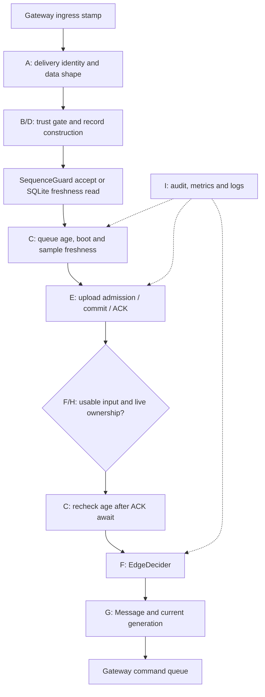

# AR-1: sensor processing boundary

Base: `2b60c00720c0551d99e9e69f9bcd65c9064c55ba`, fetched from `origin/research` on 2026-10-09. [Merged reliability CI](https://github.com/Sver0411/Smart-Agriculture-Edge-AI/actions/runs/37874772321) passed. This change covers AR-1 only. The latest stabilization report and all seven requested test files were checked before editing production code.

## Before: execution and dependencies

| Responsibility | Existing dependency | Effect / safety boundary |
| --- | --- | --- |
| A: envelope, field types, reliable identity | `messages`, `protocol`, `sensor_delivery` | Pure validation; file-backed outbox requirement remains in Gateway |
| B: action/ML trust | `trust_gate`, engine name | Pure; rule channels remain independent, ML requires all features |
| C: queue wait, age, boot; second decision check | ingress clocks, registered boot | Pure calculations; Gateway supplies clocks and rechecks after await |
| D: sensor/alert record | Message payload | Pure construction, preserving metadata and invalid-field history |
| E: dedup and durable delivery | `SequenceGuard`, `OfflineQueue`, `send_message` | Memory update, SQLite read/transaction, network I/O; commit precedes ACK |
| F: decision | `EdgeDecider` | Current policy/model; no cloud dependency |
| G: command | `Message`, command queue | Identity creation and memory queue admission |
| H: fixed zone, ownership, generation | config, `OwnershipManager` | Live control safety boundary, not a cached pipeline verdict |
| I: counters, logs and audit | Counters, logger, SQLite audit | Memory and persistent effects, ordered by Gateway |

Before extraction, `_process_sensor_message` directly combines all these responsibilities. Gateway depends on `trust_gate`, `sensor_delivery`, `protocol`, `OfflineQueue`, `EdgeDecider`, ownership and messages. No reliable upload can be treated as fresh merely because a write succeeded.

## Refactor and preserved boundaries

Implementation pending. Pure record preparation and freshness will move to `sensor_pipeline`; lifecycle, mutable ordering, transactions, ACKs, ownership and command creation remain in Gateway. No whole-Gateway argument, new background task, persistence layer or protocol/schema change is planned.

## Validation

Before refactor: the seven requested test modules passed (88 tests); added characterization tests run against the unchanged Gateway and preserve exact normalized records, sequence-update order, fixed zones, alert payloads, SQLite failure and ACK-loss behavior. Outputs stay in ignored `.research-runs/ar1-baseline/`.
