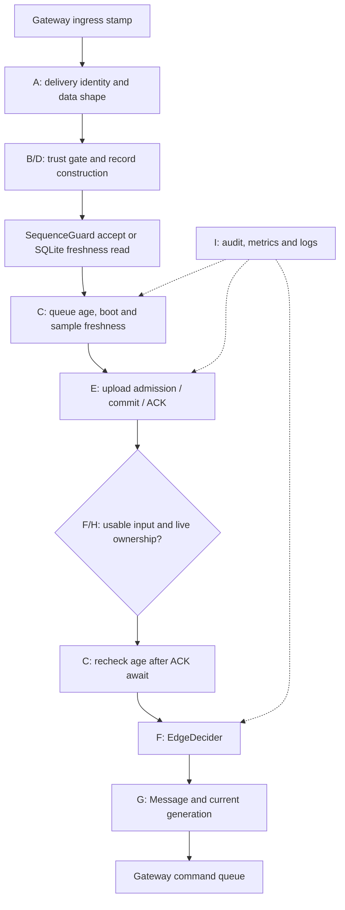
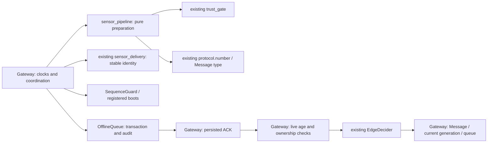

# AR-1: sensor processing boundary

Base: `2b60c00720c0551d99e9e69f9bcd65c9064c55ba`, fetched from `origin/research` on 2026-10-09. [Merged reliability CI](https://github.com/Sver0411/Smart-Agriculture-Edge-AI/actions/runs/37874772321) passed. This change covers AR-1 only. The latest stabilization report and all seven requested test files were checked before editing production code.

## Before: execution and dependencies

| Responsibility | Existing dependency | Effect / safety boundary |
| --- | --- | --- |
| A: envelope, field types, reliable identity | `messages`, `protocol`, `sensor_delivery` | Pure validation; file-backed outbox requirement remains in Gateway |
| B: action/ML trust | `trust_gate`, engine name | Pure; rule channels remain independent, ML requires all features |
| C: queue wait, age, boot; second decision check | ingress clocks, registered boot | Pure calculations; Gateway supplies clocks and rechecks after await |
| D: sensor/alert record | Message payload | Pure construction, preserving metadata and invalid-field history |
| E: dedup and durable delivery | `SequenceGuard`, `OfflineQueue`, `send_message` | Memory update, SQLite read/transaction, network I/O; commit precedes ACK |
| F: decision | `EdgeDecider` | Pure prediction reading current in-memory policy/model; control safety boundary; no cloud dependency |
| G: command | `Message`, command queue | Payload/identity creation and memory queue admission; existing rejection reporting can persist/upload |
| H: fixed zone, ownership, generation | config, `OwnershipManager` | Pure routing and live memory-state reads; control safety boundary, with existing dispatch/receiver fencing |
| I: counters, logs and audit | Counters, logger, SQLite audit | Memory and persistent effects, ordered by Gateway |

Before extraction, `_process_sensor_message` directly combines all these responsibilities. Gateway depends on `trust_gate`, `sensor_delivery`, `protocol`, `OfflineQueue`, `EdgeDecider`, ownership and messages. No reliable upload can be treated as fresh merely because a write succeeded.

## Refactor and preserved boundaries

`sensor_pipeline.py` contains four pure functions: record/trust preparation, age/boot/order eligibility, the post-admission age recheck, and alert evidence construction. Its only new abstraction is `PreparedSensor`, a per-message value container with five explicit fields. It adds no retained state. Its record/set are newly constructed; copied nested metadata keeps the existing shallow-copy behavior.

The pipeline accepts the message, engine name, explicit clock values, registered boot and an already computed freshness verdict. It returns a prepared value, a record with control eligibility and metric event names, or alert payload/reasons. It never imports Gateway, reads a clock, writes counters, admits a receipt or authorizes an actuator. An isolated subprocess import confirmed there is no Gateway reverse dependency.

The split follows effect boundaries. Gateway validates reliable identity using `sensor_delivery`, rejects an in-memory durable outbox, and applies `SequenceGuard`/SQLite checks **after** data-shape validation. Gateway then persists/admit-ACKs using the unchanged interface. It still evaluates ownership live and calls the pure age recheck with a new monotonic reading **after** admission/ACK awaits. Command identity and generation are created at the same point as before.

`Gateway._process_sensor_message`, `_admit_sensor_upload`, `_submit_upload` and `_queue_command` retain their signatures. Existing clocks, decider, trust-gate module, transport, persistence and command hooks remain injectable. Existing trust rules, message fields, schema, thresholds, log/metric meanings, result delivery and persisted server policies are unchanged. Invalid readings remain history. Reliable/physical old, unknown-age or old-boot inputs cannot create new commands; all contracts retain queue-age and sequence checks. Fixed B1→C1/B2→C2 routing and deployment fail-closed checks remain with existing ownership/dispatch code.

The processing method's source span falls from 185 to 140 lines. AST control/expression nodes (`If`, `For`, `While`, `Try`, `IfExp`, `BoolOp`) fall from 55 to 29, and maximum nested statement controls from 4 to 3. These measure coordination complexity, not removal of business rules or total repository complexity.

## Validation

Before refactor: the seven requested test modules passed (88 tests); seven added characterization cases passed against the unchanged Gateway and preserve exact normalized records, sequence-update order, fixed zones, alert payloads, SQLite failure and ACK-loss behavior. After extraction, these and 37 independent pipeline cases pass (132 focused tests). No existing expectations or golden references were changed. A deterministic comparison of the actual baseline method and refactored Gateway passed 256 combinations, including repeated input, comparing records, commands, sequence state, metrics, logs and audit states.

The full local matrix ran on clean code `add9d076a04670b63b643fb822cfa84b23e99975` (`dirty=false`). Exact arguments, logs, summaries and source hashes are retained in ignored `.research-runs/ar1-verified/`; generated data is not committed. The original runner commands are documented in the [stabilization report](../research/RELIABILITY_STABILIZATION_REPORT.md#regression-commands-and-current-status).

| Validation | Actual result |
| --- | --- |
| Full Python 3.10.21 / 3.12.14 | 631/631 each, including all 587 original tests and 44 new cases |
| Original TCP / host simulated-LoRa topology | 20/20 each |
| Repeated ownership/reliability | 20/20: stale-generation ×10, failover ×3, recovery ×3 and four other scenarios |
| Seeded LoRa comparisons | 56/56 safety checks; 43 COMPLETE, 13 INCOMPLETE deliveries, preserved |
| Actual C sleep/restore reference | 19/19 scenarios, 2800 observations |
| Cross-phase integration / external EdgeFaultLab | 10/10 and 5/5; external revision remains `c7248239f456cc877114ca1e67c5949fb4a7b958` |
| GitHub Actions on tested code | [Push](https://github.com/Sver0411/Smart-Agriculture-Edge-AI/actions/runs/37879018950) and [PR](https://github.com/Sver0411/Smart-Agriculture-Edge-AI/actions/runs/37879066650): 6/6 jobs each, every Python 3.12 experiment step successful |
| Firmware compilation | All four unchanged ESP32-S3 profiles passed: lab, light-sleep, lora-prototype, deep-sleep-experimental |

The final report-only commit changes no executable source/configuration and triggers the same complete CI again. [PR #6](https://github.com/Sver0411/Smart-Agriculture-Edge-AI/pull/6/checks) tracks final-head checks. No new P0/P1 regression was found in this validation. Results are host experiments and firmware compilation, not new physical-hardware evidence.

## Remaining architecture debt

Gateway still coordinates receipt transactions, audit transitions, mutable sequence/boot state, policy/model invocation and command dispatch. These asynchronous safety boundaries need separate design before further extraction. Clock context is still attached to the ingress Message. `PreparedSensor` intentionally does not cache ownership, generation or admission results across awaits.

Known baseline compatibility boundaries are retained, rather than repaired in AR-1: legacy lab inputs without the physical mode/reliable contract use ingress age and per-boot sequence order, without the registered-boot/device-age gate; a committed receipt interrupted by ACK-send failure does not replay its control decision on retry. Both appear in the baseline comparison/characterization. Broader freshness guarantees or decision recovery would require a separate behavior-change proposal. AR-2 may be worthwhile after reviewing these asynchronous boundaries; it is not implemented here.
